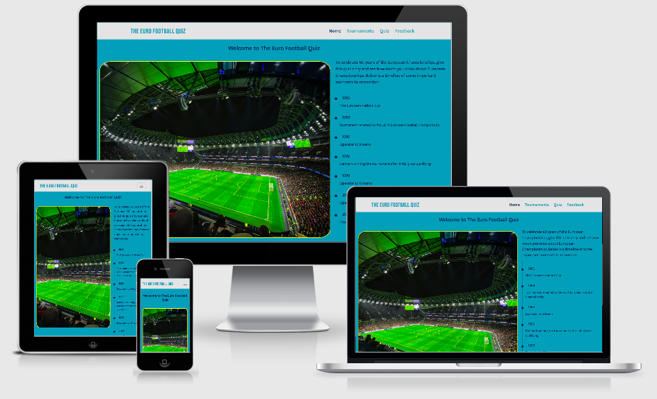

# The Euro Football Quiz 

## Code Institute - Milestone Project 2

<a href="https://liamwalsh1980.github.io/Milestone-Project-2/" target="_blank">Click here to view The Euro Football Quiz live</a>

## Table of contents
1. [Introduction](#introduction)
1. [UX](#ux)
   * [User demographic](#user-demographic)
   * [Main aims](#main-aims)
   * [User Stories](#user-stories)
1. [Development Process](#development-process)
    * [Strategy Plane](#strategy-plane)
    * [Scope Plane](#scope-plane)
    * [Structure Plane](#structure-plane)
    * [Skeleton Plane](#skeleton-plane)
        * [Balsamiq Wireframes](#balsamiq-wireframes)
            * [Homepage wireframe](#homepage---wireframe)
            * [Tournament page wireframe](#tournament-page---wireframe)
            * [Quiz page wireframe](#quiz-page---wireframe)
            * [Feedback page wireframe](#feedback-page---wireframe)
    * [Surface Plane](#surface-plane)
1. [Design Process page by page](#design-process-page-by-page)
    * [Header](#header)
    * [Footer](#footer)
    * [Homepage design](#homepage-design)
    * [Tournament page design](#tournament-page-design)
    * [Quiz page](#quiz-page)
    * [Media Queries](#media-queries)
1. [Features](#features)
    * [Existing Features](#existing-features)
        * [Header](#header)
        * [Footer](#footer)
        * [Homepage design](#homepage-design)
        * [Tournament page design](#tournament-page-design)
        * [Quiz page](#quiz-page)
    * [Features Left to Implement](#features-left-to-implement)
1. [Technology Used](#technology-used)
    * [Languages Used](#languages)
    * [Frameworks and other Technologies](#frameworks-and-other-technologies)
1. [Testing](#testing)
1. [Deployment](#deployment)
    * [Github pages](#github-pages)
    * [Forking the GitHub Repository](#forking-the-github-repository)
    * [Making a Local Clone](#making-a-local-clone)
1. [Credits](#credits)
    * [Content](#content)
    * [Code](#code)
    * [Media clip](#media-clip)
    * [Images](#images)
    * [Other](#other)
1. [Acknowledgements](#acknowledgements)
1. [Notes](#notes)

## Introduction
This Milestone project is the second of four that continues to contribute towards my Full Stack Web Developer Diploma with Code Institute. The main requirements in this project are to design an Interactive front-end website that responds to users’ actions, allowing users to actively engage on the website with purposeful decisions made which will alter the way the site displays the information and ultimately achieve the users’ goals. The main technologies that need to be used to achieve this is HTML, CSS and JavaScript with the option of using jQuery, other JavaScript libraries and external APIs.

The Euro Football Quiz is an interactive website that gives users that have an interest in International Football some useful information about the UEFA European Championships going back over 60 years. I decided to design this website based on my own interests of international football and to tie in with the latest Euro tournament that is due to start on the 11th June 2021 (Originally scheduled in June 2020, but delay due the Covid-19 Pandemic).   

The site will have four webpages and a fifth hidden page for answers to the quiz. The four main web pages will be the homepage, tournament page, quiz page and feedback page. Users will enjoy the site as it will offer information about all Euro championships played from hosts, winners and interesting facts. The site will offer a general knowledge quiz about the Euro Championships and a feedback page.  

Date this project started: 3rd June 2020 

[Back to top ⇧](#the-euro-football-quiz)

## UX

### User Demographic 

* Football fans of all ages and genders that would like to know more about the Euro Championships and test their knowledge based on what they know and what they learn from the site.  

* Mainly, football fans that are from any country in European that has qualified for any previous or up and coming Euro Championships. 

* Sporting and History students that may require information associated to international sporting events like football. 

* Football critics who may want to add to the site with their knowledge and offer feedback to potentially improve the site further. 

[Back to top ⇧](#the-euro-football-quiz)

### Main Aims

* To offer useful information to football fans/Sports fans about the history of the tournament over the last 60 years: -  

    - Where the tournament has been hosted (Google Maps with Markers) 
    - Which countries have won the tournament (YouTube media clip)  
    - Who has won the tournament the most? 
    - Outstanding player of the tournaments  
    - Standout moments 
    - Political moments related to the tournament ???

* User friendly quiz page that gives users the chance to test their knowledge based on what they know about the Euro Championships.  

* The option to make contact and provide feedback about the site.  

* Information and predictions in reference to the current Euro Championships that’s due to start on the 11th June 2021.  

* Overall, a friendly, easy to use website for football fans to visit.  

[Back to top ⇧](#the-euro-football-quiz)

## User Stories 

1. I am an England Football fan. I have always followed England since I starting watching football as a young boy in the early 1980’s. I would like to know more about the tournament going back before I was born to get a better understanding of who hosted and who won the tournament. 

1. I’m a sports enthusiast and always enjoy being challenged when it comes to football knowledge.  

1. I’m part of a weekly pub quiz team. I would like to know more about international football and gain more general knowledge to improve my contribution when I'm with my pub quiz team. 

1. I like taking my children to sports events and would like to know whether this football tournament is due to be hosted at some point soon that's close enough to travel to and attend a couple of games.  

1. I’m from America and have little knowledge of Soccer (football). The sports I played at school and watch now are mainly Baseball and Basketball. My wife is from France and says that Football is the best sport on the planet. I would like to find out more about the tournaments connected with this sport and find out if football is the biggest and best sport on the planet as my Wife says. 

[Back to top ⇧](#the-euro-football-quiz)

## Development Process 

### Strategy Plane

* With the Euro Championships starting on the 11th June 2021, I knew I wanted to create a website to celebrate this tournament with it being a 60-year anniversary. I already have good knowledge of the sport and this tournament in particular, and therefore I wanted to showcase the history and success of this sporting event whilst giving all users a chance to answer some questions about it in a form of multiple-choice. The user stories created above kept me focused on what the website should look like and offer. I therefore complete a trade-off between importance and viability/feasibility based on key areas I would like the website to have.  

### Scope Plane

* As I refined the features of the website, I knew I wanted to offer users some good knowledge of this football tournament and offer the option to interact with answering some multiple-choice questions. I wanted to make sure that I got the chance to showcase JavaScript and therefore I decided that the quiz page, markers on a google map and a feedback form would successful achieve this. I also decided to add a vertical timeline which would highlight key milestones of the tournament which I believe would look appealing and interesting to users. 

[Back to top ⇧](#the-euro-football-quiz)

### Structure Plane

* I wanted to keep the Structure straightforward so that all users visiting the site would see the same theme and layout making their experience on the site enjoyable and easy to navigate around. The homepage would have minimum content with a strong ‘hero’ image of what the site is about with a brief welcome message, timeline of milestone events relating to the football tournament and then options to click on. The options the user would have to move on to would be the tournament page giving lots of information about the history of the tournament, countries that hosted it, countries that won it and future confirmed Euro tournament events to look forward to. Other options for the user would be to click on the quiz page to answer multiple-choice questions and finally a feedback form page for users to complete. The quiz page would also generate a score based on how many questions the user gets right once submitted. The user can then try again, click on the answers page or navigate back to the homepage or tournament page via the navigation bar at the top. The answers page would be available to view only when the quiz page was submitted after all questions were answered correctly or incorrectly. 

* The below spreadsheet gave me real focus on what I wanted to add to each page. This was also used to guide me through each step of the design giving me the chance to include everything I wanted without missing any feature out. I would highlight in a different colour each feature once it's completed to show what's left to finish.  

[Back to top ⇧](#the-euro-football-quiz)

### Skeleton Plane

* Once I finished laying out the structure, I then used the Balsamiq wireframes tool to complete detailed blueprints of all 5 pages across mobile, tablet and desktop screen sizes. This helped me visualise what each page should look like and in turn create a good user experience for all site visitors. I decided to look at adding down arrows on the quiz page which makes this page easier for users to navigate from one question to the next. I also started to look at colour options and knew that I wanted to use teal and turquoise pallets as this would match the colour scheme associated to this football tournaments official website. More research in reference to colours would be done later on in the design process. 

[Back to top ⇧](#the-euro-football-quiz)

#### Balsamiq Wireframes

#### Please click <a href="" target="_blank">PDF Wireframes </a> to see all versions 

#### Homepage - wireframe

#### Tournament page - wireframe

#### Quiz page - wireframe

#### Answerts page - wireframe

#### Feedback page - wireframe

[Back to top ⇧](#the-euro-football-quiz)

### Surface Plane

* With the Balsamiq blueprints completed and referencing the user stories, I created the website knowing how many pages was required, the layout of each page and what was important and achievable to include in the timescales I had to work with. For reference all 5 pages (homepage, tournament page, quiz page, answers page and feedback page) would have the same colour scheme, font styling, header layout and footer layout. The header includes a text logo and a navigation bar. The footer would include social media and copyright icons. 

* As my target audience would be mainly football fans from all around Europe, I wanted the site to have fresh appeal with eye catching images, useful information, a video clip central to the winning teams of each tournament, a quiz that users would enjoy and a feedback form that users can complete. All this I believe would not only give users a good experience now, they would also want to return to the site in the future as the site content, quiz questions and future tournament information would be added over time with potential new features I.e., live chat for interaction with other users, links to purchase merchandise and tickets and competitions available to enter.  

* When starting the design of the website the first thing I wanted to do was set the default font style, font colours and background colours within the body element for all HTML pages. Full details can be found below for reference: - 

    - Font-family: 'Mukta', sans-serif; (fallback) will only be used if Mukta doesn't load) 
    - Font colour: #000 (Black)
    - Background Colour: #409eb7 (Boston Blue)

* To offer an attractive website for users to visit, I decided to use the following fonts and colours 

    - Main header font-family: 'Bebas Neue', cursive (fallback)
    - Main header font size on mobile -  
    - Main header font size on tablet -  
    - Main header font size on desktop - 30px
 
    - Sub header font-family: 'Mukta', sans-serif (fallback)
    - Sub header font size on mobile -  
    - Sub header font size on tablet -  
    - Sub header font size on desktop - h3 header

    - Content font-family: 'Mukta', sans-serif (fallback)
    - Content header font size on mobile -  
    - Content header font size on tablet -  
    - Content header font size on desktop - 16px

    - Colour scheme: - 
    - Header: - Background color is #e4e4e4 (light grey) and font color is #409eb7 (Boston Blue). The text logo and navigation bar page titles change color when hovered over to #082d58 (Dark Blue). The same color is used to highlight which page the user is currently on aswell. 
    - Body: - Background color stays as default #409eb7 (Boston Blue) and font color is changed from the default #000 (Black) to #082d58 (Dark Blue). 
    - Footer: - Background color stays the same as the default body color #409eb7 (Boston Blue). The social media icons is #409eb7 (Boston Blue) and placed in #e4e4e4 (light grey) circles. When any icon is hovered over the background color of the small circles change to #FFFF00 (Yellow) with the font color changing to #082d58 (Dark Blue). The copyright text header h5 is also in #082d58 (Dark Blue). 
    - #FFFF00 (Yellow) is also used when hovering over an event within the timeline on the homepage indicated that these area links that can be clicked. I also used Yellow as a border color around the homepage hero image, the media clip on the tournament page, the google map on the tournament page and as a hover for all buttons on all pages.
    - After carefully testing and researching colors that works well together i am confident that the above colors chosen work to provide good UX and easy on the eye with some good overall contrasts.

[Back to top ⇧](#the-euro-football-quiz)

* I took a little time testing different fonts and colours and at one point decided to use Yellow for the header and footer backgrounds. This looked good but looked to similar to other well-known brands like Aviva and EE. I therefore, reverting back to using a teal/turquoise with a light grey which looks elegant and attractive.

* The homepage and feedback page has the least information. The homepage is designed as a strong landing page to gain the users attention with an eye-catching image, summary of what the site is about and a timeline of interesting moments relating to the football tournament. The user then can move forward to the tournaments page or quiz page. I believe that this site and format I have selected will work well on all screen sizes and particular well on mobile screen as it can be used to quickly test someone's knowledge on the go, for example, out with friends, whilst travelling to pass the time etc.  

[Back to top ⇧](#the-euro-football-quiz)

## Design Process page by page

### Header

* The header across all pages is the same.
* The test logo 'THE EURO FOOTBALL QUIZ' is at the top left in uppercase using the font-family: 'Bebas Neue', cursive (fall back). The color is Boston Blue and when hovered over will turn Dark Blue to show its a link to the homepage.
* The navigation bar is positioned to the right and highlights all pages for the user to click on. The font styling is the default font-family: 'Mukta', sans-serif (fall back). The color for the page titles within the navigation bar is the default Boston Blue. When hovering over any of the page titles the color of the page title changes to Dark Blue and increased in size from 20px to 30px. 
* The header is fixed to the top so that it will travel with the user as they scroll down the webpage. 
* Bootstrap5 was used to create this header navigation bar with text logo.
* I decided to add the bootstrap class container-fluid to the header for improved responsiveness on all screen sizes.

### Footer

* The footer holds five social media icons found using <a href="https://www.fontawesome.com" target="_blank">Font Awesome</a> for the images. The images sit inside a small round light grey background. The color of all images is dark blue and when hovering over any of the icons the background color changes to yellow. Each icon image is linked to the relevant websites and when clicked will take the user to the whichever social media platform chosen. 
* Below the social media icons there is some copyright text in the Dark Blue color.

[Back to top ⇧](#the-euro-football-quiz)

### Homepage design

* I wanted to keep the homepage simple with a central welcome header and a stiking image of a football ground full of fans showing how popular the sport is. I found the perfect <a href="https://www.pexels.com/photo/people-sitting-on-stadium-seats-3991976/" target="_blank">Image</a> at <a href="https://www.pexels.com" target="_blank">Pexels</a>. I decided to add a thin yellow boarder around the image to make it stand out more and with a little curve finish to each corner this image now looks great. 

* On bigger screen sizes users will see to the right of the hero image a sub title paragraph and a timeline of important moments throughout the tournamenets history in chronological order. All information in the timeline is also a link to an external source for more reading. This is indicated when a user hovers over any timeline sentence,to find it turns yellow. On smaller screen sizes the timeline is below the image for better UX. All external sources of information on the timeline was sourced using Wikipedia. 

* Below the hero image and timeline users will find three buttons to click on. These buttons are identical in size, shape and color (Dark blue background with boston blue font) and do the following: -

    - Take the quiz (takes the user to the quiz.html page to start the multiple choice quiz)
    - Leave feedback (takes the user to the feedback.html page to complete)
    - Find out more (takes the user to the tournaments.html page for more information)

* When a user hovers over any of these buttons the background color changes to Yellow and the font color changes to Dark Blue. This indicates to the user that they will move to another page if clicked.

* Bootstrap column grid and Media queries is used to make sure that across all screen sizes the image, timeline, text and buttons work well. 

[Back to top ⇧](#the-euro-football-quiz)

### Tournament page design

* The tournament page is where you will find all the past, present and future information about this football tournament. I wanted to make sure that the design of this page was easy to navigate through and therefore i used the Bootstrap grid system, rows and columns to position images, sub headers, paragraphs, media clip and google map.

* I kept the color scheme, fonts and font sizing the same as the homepage for good overall UX.

* Below the sub header at the top of the page, users will see the Euro 2020 logo with paragraphs giving an introduction and general information about the tournament.
This <a href="https://www.google.com/search?q=uefa+euro+2020+trophy&tbm=isch&ved=2ahUKEwif26nwlIjxAhX-gc4BHRXLDEMQ2-cCegQIABAA&oq=uefa+euro+2020+trophy&gs_lcp=CgNpbWcQAzICCAAyBAgAEBgyBAgAEBg6BAgjECc6BggAEAcQHjoGCAAQCBAeUMZoWKSMAWCajQFoBnAAeACAAUWIAbkGkgECMTSYAQCgAQGqAQtnd3Mtd2l6LWltZ8ABAQ&sclient=img&ei=XHO_YJ-9L_6Dur4PlZazmAQ&bih=821&biw=1440&rlz=1C5CHFA_enGB821GB821#imgrc=JJyZWk_7mb5qgM" target="_blank">image</a> was sourced using <a href="https://en.wikipedia.org/wiki/UEFA_Euro_2020" target="_blank">Wikipedia</a>. The content for the paragraphs were also sourced using <a href="https://en.wikipedia.org/wiki/UEFA_European_Championship" target="_blank">Wikipedia</a>.

* Below there is more information about who hosted the tournament since its started in 1960. Half way through the paragraphs there is an image of the winning trophy being deplayed. The <a href="https://www.uefa.com/uefaeuro-2020/news/0258-0e51de1a172f-12472925ce41-1000/" target="_blank"> trophy image</a> was sourced using the official UEFA Euro 2020 website. The content for this part of the page was sourced from <a href="https://www.worldsoccer.com/euro-2020/past-european-championship-hosts-409195" target="_blank">World Soccer</a>.

* Below is a media clip showing all winners from 1960 to 2016. The media clip was sourced on YouTube. I made sure this took up the whole row using Bootstrap columns accordingly with good space either side. The <a href="https://www.youtube.com/watch?v=F6RTd4TJOhA" target="_blank">media clip</a> was sourced from <a href="https://www.youtube.com/" target="_blank">YouTube</a> with thanks to youtube channel <a href="https://www.youtube.com/channel/UCQnyQjCjufnqKL4dKBuqlOQ" target="_blank">Julian 87</a>. 

* Below is a sub header and an ordered list (alphabetical) of cities that are due to host the Euro 2020. On the same row and to compliment the list there is an interactive google map. The map is rendered using an API key from the Google Maps Platform. The map also has markers and clusters in place showering users where the hosting cities are in Europe. The content for this row was sourced from the official <a href="https://www.uefa.com/uefaeuro-2020/news/0255-0d9f2f2c93bf-ad932fd5ee55-1000--euro-all-you-need-to-know/" target="_blank">UEFA Euro 2020</a> website.

* Below the map there is two short paragraphs confirming where future tournaments will be held. I sourced this information for the <a href="https://en.wikipedia.org/wiki/UEFA_Euro_2024" target="_blank">Euro 2024</a> and <a href="https://en.wikipedia.org/wiki/UEFA_Euro_2028" target="_blank">Euro 2028</a> on Wikipedia.

* Below the future tournaments paragraphs users will find two buttons to click on. These buttons are identical in size, shape and color (Dark blue background with boston blue font) and do the following: -

    - Take the quiz (takes the user to the quiz.html page to start the multiple choice quiz)
    - Leave feedback (takes the user to the feedback.html page to complete)

* When a user hovers over either of these buttons the background color changes to Yellow and the font color changes to Dark Blue. This indicates to the user that they will move to another page if clicked.

* I used Horizontal Rules and Line Breaks to seperate all the secionts within the body of this webpage to make sure it was easier to read and to acheieve better UX. Also used is bootstrap container-fluid on all rows with paragraphs for structure and consistency. 

[Back to top ⇧](#the-euro-football-quiz)

### Quiz page

* Designing this page was the most challenging part of this project. I started with just adding a sub-header with questions and three possible answers to select from as each question would be multiple choice. I seperated each question/answers with a horizonal line but there was something missing. I decided to add an image clue to each question which not only would assist the user but also offers a better overal look. 

* I kept the color scheme and overall structure the same as the homepage and tournament page for good overall UX.

* The questions were written in h5 header HTML with the answers in the form of buttons. All buttons have been given unique IDs for the purpose of Javascript. 

* I structured each question and selection of answers on the left side of laptop screen sizes and above and made sure that on smaller screen sizes the format would be veritcal with the question first then 3 possible answer buttons below with the image clue to finish. The horizontal line is very important here to seperate each question/answers/image. This was done using Bootstrap columns. 

* All images were found online from different sources. Full details can be found in the credits section with links to each source. 

* Below the questions, users will find the submit answers button to click on once all questions have been selected with an answer. If this button is clicked with any question(s) not answered the user will be shown an error message indicating that at least one question in the quiz hasn't been answered yet. This button is larger than all other buttons and is in a different background color of bright orange (#f2993e). 

* JAVASCRIPT DOCUMENTATION TO BE ADDED HERE - users score and try again

* Below the user score and try again buttons users will find another buttons to click on. This button is identical in size, shape and color (Dark blue background with boston blue font) to the other buttons on the homepage, tournament page and quiz page (answer buttons) and do the following: -

    - Leave feedback (takes the user to the feedback.html page to complete)

* When a user hovers over either of these buttons the background color changes to Yellow and the font color changes to Dark Blue. This indicates to the user that they will move to another page if clicked.

* I used Horizontal Rules and Line Breaks to seperate all the secionts within the body of this webpage to make sure it was easier to read and to acheieve better UX. Also used is bootstrap container-fluid on all rows with paragraphs for structure and consistency.

[Back to top ⇧](#the-euro-football-quiz)

## Technology Used

* Font Awesome (link to add)

[Back to top ⇧](#the-euro-football-quiz)

## Credits

* Hero image on the homepage - Photo by Dom Le Roy from Pexels
<a href="https://www.pexels.com/photo/people-sitting-on-stadium-seats-3991976/" target="_blank">Click here to view image from its source</a>

* Wikipedia for all European Football history
<a href="https://en.wikipedia.org/wiki/UEFA_European_Championship" target="_blank">click here to see the page</a>

* Wikipedia image for the 
<a href="https://www.google.com/search?q=uefa+euro+2020+trophy&tbm=isch&ved=2ahUKEwif26nwlIjxAhX-gc4BHRXLDEMQ2-cCegQIABAA&oq=uefa+euro+2020+trophy&gs_lcp=CgNpbWcQAzICCAAyBAgAEBgyBAgAEBg6BAgjECc6BggAEAcQHjoGCAAQCBAeUMZoWKSMAWCajQFoBnAAeACAAUWIAbkGkgECMTSYAQCgAQGqAQtnd3Mtd2l6LWltZ8ABAQ&sclient=img&ei=XHO_YJ-9L_6Dur4PlZazmAQ&bih=821&biw=1440&rlz=1C5CHFA_enGB821GB821#imgrc=JJyZWk_7mb5qgM" target="_blank">Euro 2020 logo</a> on the tournament page

* Wikipedia page where the
<a href="https://en.wikipedia.org/wiki/UEFA_Euro_2020" target="_blank">Euro 2020 logo</a> came from.

* I sourced the paragraph content for previous hosts from 
<a href="https://www.worldsoccer.com/euro-2020/past-european-championship-hosts-409195" target="_blank">World Soccer</a> 

* I sourced the <a href="https://www.youtube.com/watch?v=F6RTd4TJOhA" target="_blank">media clip</a> from <a href="https://www.youtube.com/" target="_blank">YouTube</a> with thanks to <a href="https://www.youtube.com/channel/UCQnyQjCjufnqKL4dKBuqlOQ" target="_blank">Julian 87</a> 

* I sourced the content to support the Google Map image in the tournament page using <a href="https://www.uefa.com/uefaeuro-2020/news/0255-0d9f2f2c93bf-ad932fd5ee55-1000--euro-all-you-need-to-know/" target="_blank">UEFA Euro 2020</a> website.

* I sourced the content for <a href="https://en.wikipedia.org/wiki/UEFA_Euro_2024" target="_blank">Euro 2024</a> and <a href="https://en.wikipedia.org/wiki/UEFA_Euro_2028" target="_blank">Euro 2028</a>  tournaments from Wikipedia.

* The <a href="https://www.uefa.com/uefaeuro-2020/news/0258-0e51de1a172f-12472925ce41-1000/" target="_blank"> trophy image</a> was sourced from the official UEFA Euro 2020 website.

* Quiz Question 1 - <a href="https://cultofcalcio.com/the-history-of-the-uefa-euro-1960-the-humble-beginnings/" target="_blank">image</a> 

* Quiz Question 2 - <a href="https://www.thesundaily.my/sport/romania-expects-quarter-full-stadium-for-euro-2020-games-BE7314838" target="_blank">image</a>

* Quiz Question 3 - <a href="https://www.vecteezy.com/vector-art/2153351-european-football-2020-tournament-flag-set-vector-country-flag-set-for-soccer-championship" target="_blank">image</a>

* Quiz Question 4 - <a href="https://www.eurosport.co.uk/football/euro-icons-1992-peter-schmeichel-the-great-dane_sto7776495/story.shtml" target="_blank">image</a>

* Quiz Question 5 - <a href="https://www.google.com/search?q=euro+2028+&tbm=isch&ved=2ahUKEwjZwbGnvpDxAhUE2xoKHVn9CNkQ2-cCegQIABAA&oq=euro+2028+&gs_lcp=CgNpbWcQAzICCAAyAggAMgQIABAeMgYIABAFEB4yBggAEAUQHjIECAAQHjIECAAQGDIECAAQGDIECAAQGDIECAAQGFDptBlY6bQZYNm9GWgAcAB4AIABlwGIAZcBkgEDMC4xmAEAoAEBqgELZ3dzLXdpei1pbWfAAQE&sclient=img&ei=jNDDYNlLhLZr2fqjyA0&rlz=1C5CHFA_enGB821GB821#imgrc=8qk901TzJpe8HM" target="_blank">image</a>

* Quiz Question 6 - <a href="https://en.wikipedia.org/wiki/UEFA_Euro_2004#/media/File:UEFA_Euro_2004_logo.svg" target="_blank">image</a>

[Back to top ⇧](#the-euro-football-quiz)

## Bugs

* API key issues 
https://developers.google.com/maps/documentation/javascript/error-messages#api-not-activated-map-error

* Borders around quiz question images. Using the background size property with the cover value would cause an issue with the images on smaller screen sizes. I changed the value for all images from cover to contain which worked for what i wanted to acheieve which was to make sure that all of the image is shown on screen sizes. 

* On the feedback html page and within the form there was an issue with the content wasn't refreshing after the 'Leave feedback' submit button was clicked. 

[Back to top ⇧](#the-euro-football-quiz)

        
 

    
 

Welcome Liam Walsh,

This is the Code Institute student template for Gitpod. We have preinstalled all of the tools you need to get started. You can safely delete this README.md file, or change it for your own project. Please do read it at least once, though! It contains some important information about Gitpod and the extensions we use.

## Gitpod Reminders

To run a frontend (HTML, CSS, Javascript only) application in Gitpod, in the terminal, type:

`python3 -m http.server`

A blue button should appear to click: _Make Public_,

Another blue button should appear to click: _Open Browser_.

To run a backend Python file, type `python3 app.py`, if your Python file is named `app.py` of course.

A blue button should appear to click: _Make Public_,

Another blue button should appear to click: _Open Browser_.

In Gitpod you have superuser security privileges by default. Therefore you do not need to use the `sudo` (superuser do) command in the bash terminal in any of the lessons.

To log into the Heroku toolbelt CLI:

1. Log in to your Heroku account and go to *Account Settings* in the menu under your avatar.
2. Scroll down to the *API Key* and click *Reveal*
3. Copy the key
4. In Gitpod, from the terminal, run `heroku_config`
5. Paste in your API key when asked

You can now use the `heroku` CLI program - try running `heroku apps` to confirm it works. This API key is unique and private to you so do not share it. If you accidently make it public then you can create a new one with _Regenerate API Key_.

## Updates Since The Instructional Video

We continually tweak and adjust this template to help give you the best experience. Here is the version history:

**May 10 2021:** Added `heroku_config` script to allow Heroku API key to be stored as an environment variable.

**April 7 2021:** Upgraded the template for VS Code instead of Theia.

**October 21 2020:** Versions of the HTMLHint, Prettier, Bootstrap4 CDN and Auto Close extensions updated. The Python extension needs to stay the same version for now.

**October 08 2020:** Additional large Gitpod files (`core.mongo*` and `core.python*`) are now hidden in the Explorer, and have been added to the `.gitignore` by default.

**September 22 2020:** Gitpod occasionally creates large `core.Microsoft` files. These are now hidden in the Explorer. A `.gitignore` file has been created to make sure these files will not be committed, along with other common files.

**April 16 2020:** The template now automatically installs MySQL instead of relying on the Gitpod MySQL image. The message about a Python linter not being installed has been dealt with, and the set-up files are now hidden in the Gitpod file explorer.

**April 13 2020:** Added the _Prettier_ code beautifier extension instead of the code formatter built-in to Gitpod.

**February 2020:** The initialisation files now _do not_ auto-delete. They will remain in your project. You can safely ignore them. They just make sure that your workspace is configured correctly each time you open it. It will also prevent the Gitpod configuration popup from appearing.

**December 2019:** Added Eventyret's Bootstrap 4 extension. Type `!bscdn` in a HTML file to add the Bootstrap boilerplate. Check out the <a href="https://github.com/Eventyret/vscode-bcdn" target="_blank">README.md file at the official repo</a> for more options.

---

Happy coding!
