# The Euro Football Quiz 

## Code Institute - Milestone Project 2

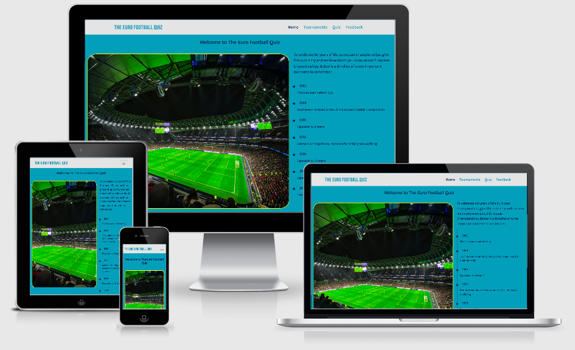

<a href="https://liamwalsh1980.github.io/Milestone-Project-2/" target="_blank">Click here to view The Euro Football Quiz live</a>

## Table of contents
1. [Introduction](#introduction)
1. [UX](#ux)
   * [User demographic](#user-demographic)
   * [Main aims](#main-aims)
   * [User Stories](#user-stories)
1. [Development Process](#development-process)
    * [Strategy Plane](#strategy-plane)
    * [Scope Plane](#scope-plane)
    * [Structure Plane](#structure-plane)
    * [Skeleton Plane](#skeleton-plane)
        * [Balsamiq Wireframes](#balsamiq-wireframes)
            * [Homepage wireframe](#homepage---wireframe)
            * [Tournament page wireframe](#tournament-page---wireframe)
            * [Quiz page wireframe](#quiz-page---wireframe)
            * [Feedback page wireframe](#feedback-page---wireframe)
            * [Answers page wireframe](#answers-page---wireframe)
    * [Surface Plane](#surface-plane)
1. [Design Process page by page](#design-process-page-by-page)
    * [Header design](#header-design)
    * [Footer design](#footer-design)
    * [Homepage design](#homepage-design)
    * [Tournaments page design](#tournaments-page-design)
    * [Quiz page design](#quiz-page-design)
    * [Feedback page design](#feedback-page-design)
    * [Answers page design](#answers-page-design)
    * [Media Queries](#media-queries)
1. [Features](#features)
    * [Existing Features](#existing-features)
        * [All pages](#all-pages)
        * [Homepage](#homepage)
        * [Tournaments page](#tournaments-page)
        * [Quiz page](#quiz-page)
        * [Feedback page](#feedback-page)
        * [Answers page](#answers-page)
    * [Features Left to Implement](#features-left-to-implement)
1. [Technology Used](#technology-used)
    * [Languages Used](#languages)
    * [Frameworks and libraries](#frameworks-and-libraries)
    * [Other technologies](#other-technologies)
1. [Testing](#testing)
1. [Deployment](#deployment)
    * [Github pages](#github-pages)
    * [Forking the GitHub Repository](#forking-the-github-repository)
    * [Making a Local Clone](#making-a-local-clone)
1. [Credits](#credits)
    * [Images](#images)
    * [Content](#content)
    * [Media clip](#media-clip)
    * [JavaScript](#javaScript)
1. [Acknowledgements](#acknowledgements)
1. [Notes](#notes)

## Introduction
This Milestone project is the second of four that continues to contribute towards my Full Stack Web Developer Diploma with Code Institute. The main requirements in this project are to design an Interactive front-end website that responds to users’ actions, allowing users to actively engage on the website with purposeful decisions made which will alter the way the site displays the information and ultimately achieve the users’ goals. The main technologies that need to be used to achieve this is HTML, CSS and JavaScript with the option of using jQuery, other JavaScript libraries and external APIs.

The Euro Football Quiz is an interactive website that gives users that have an interest in International Football some useful information about the UEFA European Championships going back over 60 years. I decided to design this website based on my own interests of international football and to tie in with the latest Euro tournament that is due to start on the 11th June 2021 (Originally scheduled in June 2020, but delay due the Covid-19 Pandemic).   

The site will have four webpages and a fifth hidden page for answers to the quiz. The four main web pages will be the homepage, tournament page, quiz page and feedback page. Users will enjoy the site as it will offer information about all Euro championships played from hosts, winners and interesting facts. The site will offer a general knowledge quiz about the Euro Championships and a feedback page.  

Date this project started: 3rd June 2020 

[Back to top ⇧](#the-euro-football-quiz)

## UX

### User Demographic 

* Football fans of all ages and genders that would like to know more about the Euro Championships and test their knowledge based on what they know and what they learn from the site.  

* Mainly, football fans that are from any country in European that has qualified for any previous or up and coming Euro Championships. 

* Sporting and History students that may require information associated to international sporting events like football. 

* Football critics who may want to add to the site with their knowledge and offer feedback to potentially improve the site further. 

[Back to top ⇧](#the-euro-football-quiz)

### Main Aims

* To offer useful information to football fans/Sports fans about the history of the tournament over the last 60 years: -  

    - Where the tournament has been hosted (Google Maps with Markers) 
    - Which countries have won the tournament (YouTube media clip)  
    - Who has won the tournament the most
    - Future tournament information  
    - Standout moments 

* User friendly quiz page that gives users the chance to test their knowledge based on what they know about the Euro Championships.  

* The option to make contact and provide feedback about the site.  

* Information and predictions in reference to the current Euro Championships that’s due to start on the 11th June 2021.  

* Overall, a friendly, easy to use website for football fans to visit.  

[Back to top ⇧](#the-euro-football-quiz)

## User Stories 

1. I am an England Football fan. I have always followed England since I starting watching football as a young boy in the early 1980’s. I would like to know more about the tournament going back before I was born to get a better understanding of who hosted and who won the tournament. 

1. I’m a sports enthusiast and always enjoy being challenged when it comes to football knowledge.  

1. I’m part of a weekly pub quiz team. I would like to know more about international football and gain more general knowledge to improve my contribution when I'm with my pub quiz team. 

1. I like taking my children to sports events and would like to know whether this football tournament is due to be hosted at some point soon that's close enough to travel to and attend a couple of games.  

1. I would like to been notified of future tournaments relating to International European football.

[Back to top ⇧](#the-euro-football-quiz)

## Development Process 

### Strategy Plane

* With the Euro Championships starting on the 11th June 2021, I knew I wanted to create a website to celebrate this tournament with it being a 60-year anniversary. I already have good knowledge of the sport and this tournament in particular, and therefore I wanted to showcase the history and success of this sporting event whilst giving all users a chance to answer some questions about it in a form of multiple-choice. The user stories created above kept me focused on what the website should look like and offer. I therefore complete a trade-off between importance and viability/feasibility based on key areas I would like the website to have.  

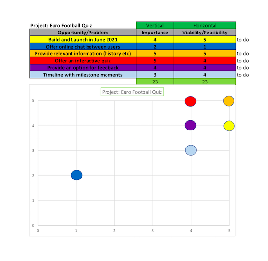

### Scope Plane

* As I refined the features of the website, I knew I wanted to offer users some good knowledge of this football tournament and offer the option to interact with answering some multiple-choice questions. I wanted to make sure that I got the chance to showcase JavaScript and therefore I decided that the quiz page, markers on a google map and a feedback form would successful achieve this. I also decided to add a vertical timeline which would highlight key milestones of the tournament which I believe would look appealing and interesting to users. 

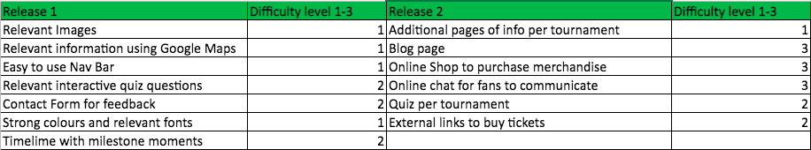

[Back to top ⇧](#the-euro-football-quiz)

### Structure Plane

* I wanted to keep the Structure straightforward so that all users visiting the site would see the same theme and layout making their experience on the site enjoyable and easy to navigate around. The homepage would have minimum content with a strong ‘hero’ image of what the site is about with a brief welcome message, timeline of milestone events relating to the football tournament and then options to click on. The options the user would have to move on to would be the tournament page giving lots of information about the history of the tournament, countries that hosted it, countries that won it and future confirmed Euro tournament events to look forward to. Other options for the user would be to click on the quiz page to answer multiple-choice questions and finally a feedback form page for users to complete. The quiz page would also generate a score based on how many questions the user gets right once submitted. The user can then try again, click on the answers page or navigate back to the homepage or tournament page via the navigation bar at the top. The answers page would be available to view only when the quiz page was submitted after all questions were answered correctly or incorrectly. 

* The below spreadsheet gave me real focus on what I wanted to add to each page. This was also used to guide me through each step of the design giving me the chance to include everything I wanted without missing any feature out. I would highlight in a different colour each feature once it's completed to show what's left to finish.  

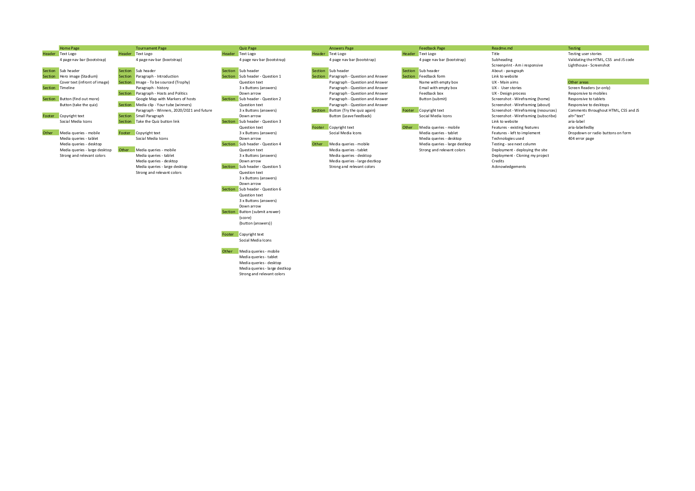
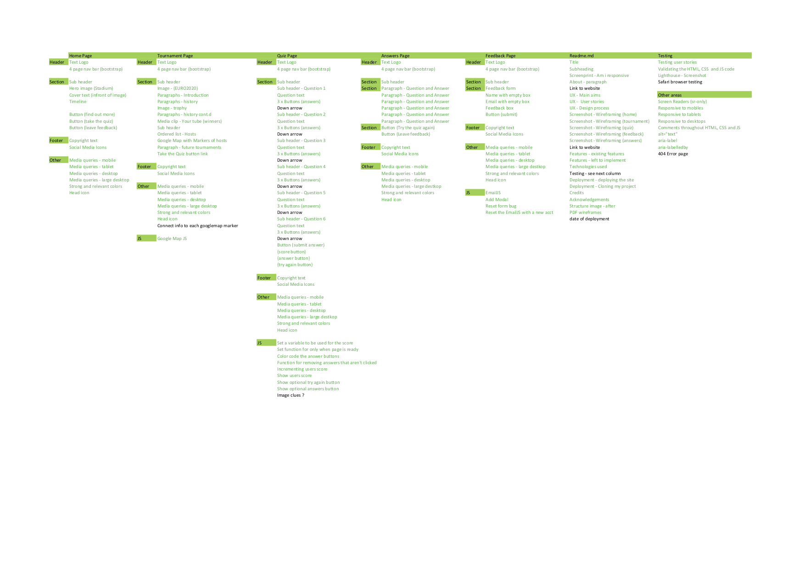

[Back to top ⇧](#the-euro-football-quiz)

### Skeleton Plane

* Once I finished laying out the structure, I then used the Balsamiq wireframes tool to complete detailed blueprints of all 5 pages across mobile, tablet and desktop screen sizes. This helped me visualise what each page should look like and in turn create a good user experience for all site visitors. I decided to look at adding down arrows on the quiz page which makes this page easier for users to navigate from one question to the next. I also started to look at colour options and knew that I wanted to use teal and turquoise pallets as this would match the colour scheme associated to this football tournaments official website. More research in reference to colours would be done later on in the design process. 

[Back to top ⇧](#the-euro-football-quiz)

#### Balsamiq Wireframes

#### Please click <a href="https://github.com/liamwalsh1980/Milestone-Project-2/blob/master/assets/images/readme/wireframes/euros.pdf" target="_blank">PDF Wireframes </a> to see all versions 

#### Homepage - wireframe
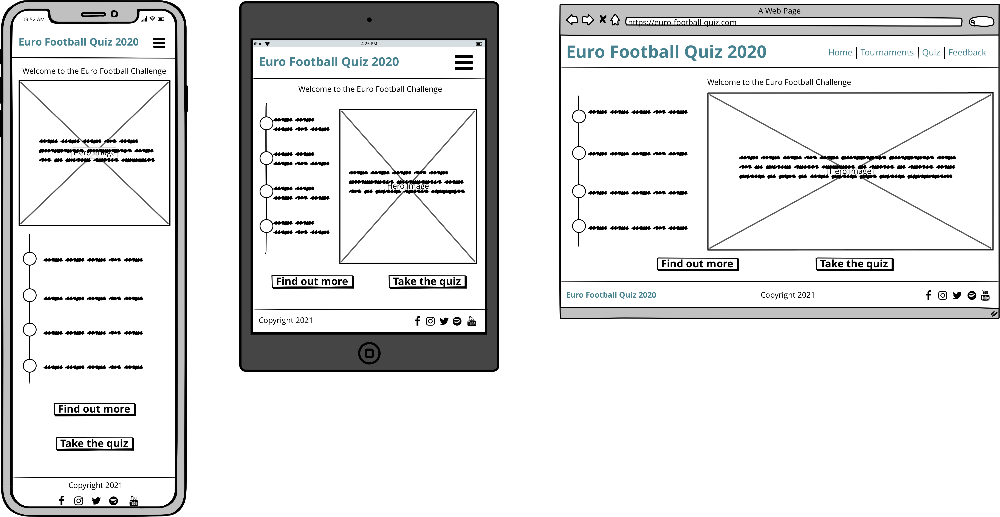
#### Tournament page - wireframe
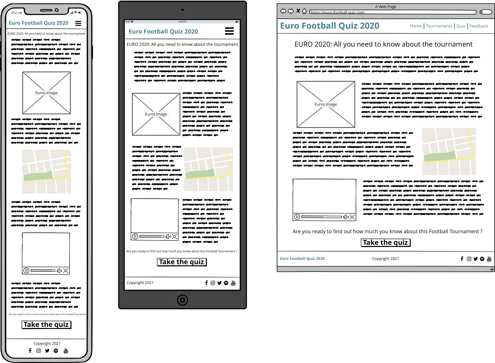
#### Quiz page - wireframe
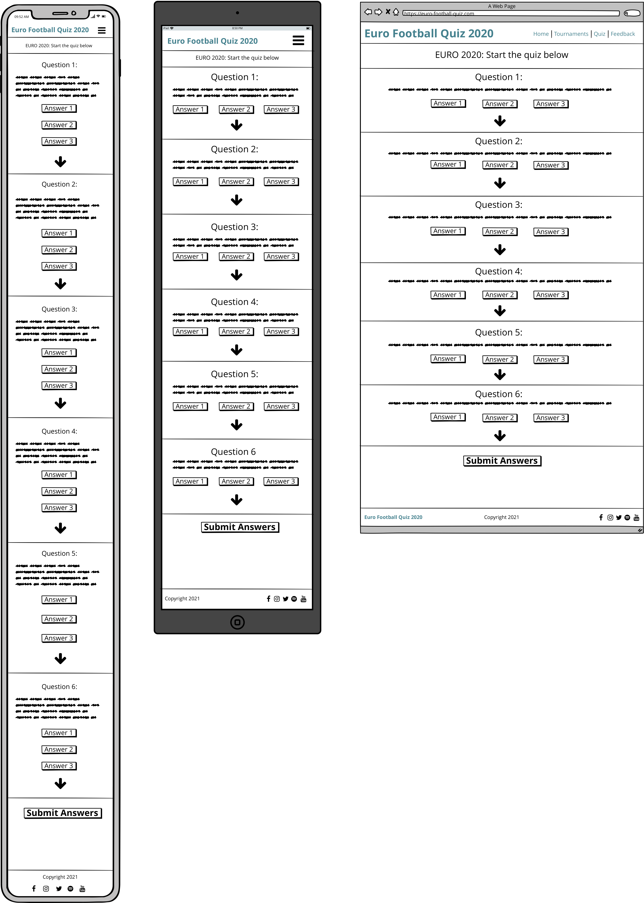
#### Feedback page - wireframe
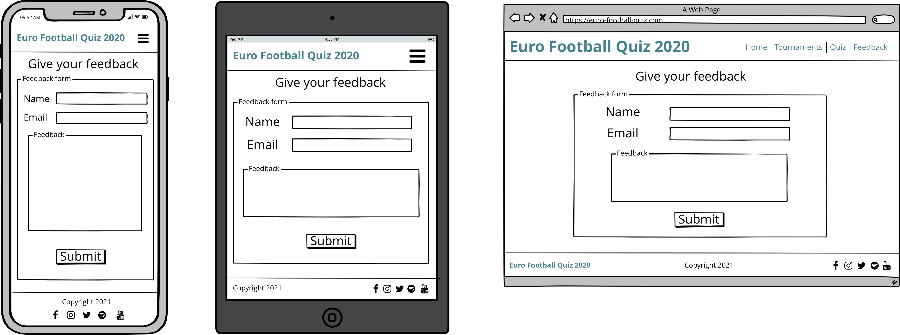
#### Answers page - wireframe
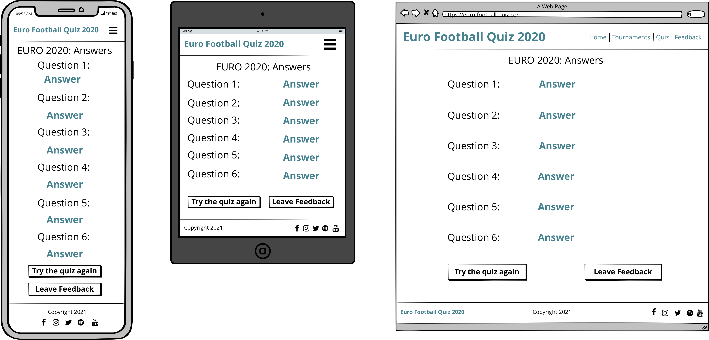

[Back to top ⇧](#the-euro-football-quiz)

### Surface Plane

* With the Balsamiq blueprints completed and referencing the user stories, I created the website knowing how many pages was required, the layout of each page and what was important and achievable to include in the timescales I had to work with. For reference all five pages (homepage, tournament page, quiz page, answers page and feedback page) would have the same colour scheme, font styling, header layout and footer layout. The header includes a text logo and a navigation bar. The footer would include social media and copyright icons. 

* As my target audience would be mainly football fans from all around Europe, I wanted the site to have fresh appeal with eye catching images, useful information, a video clip central to the winning teams of each tournament, a quiz that users would enjoy and a feedback form that users can complete. All this I believe would not only give users a good experience now, they would also want to return to the site in the future as the site content, quiz questions and future tournament information would be added over time with potential new features I.e., live chat for interaction with other users, links to purchase merchandise and tickets and competitions available to enter.  

* When starting the design of the website the first thing I wanted to do was set the default font style, font colours and background colours within the body element for all HTML pages. Full details can be found below for reference: - 

    - Font-family: 'Mukta', sans-serif; (fallback) will only be used if Mukta doesn't load) 
    - Font colour: #000 (Black)
    - Background Colour: #409eb7 (Boston Blue)

* To offer an attractive website for users to visit, I decided to use the following fonts and colours 

    - Main logo in the header: font-family: 'Bebas Neue', cursive (fallback)
    - Sub header font-family: - 'Mukta', sans-serif (fallback)
    - Content font-family: 'Mukta', sans-serif (fallback)
    - Header: - Background color is #e4e4e4 (light grey) and font color is #409eb7 (Boston Blue). The text logo changes color when hovered over to #082d58 (Dark Blue). The same color is used to highlight which page the user is currently on as well. The navigation bar title name changes color when hovered over to #f2993e (Bright Orange). 
    - Body: - Background color stays as default #409eb7 (Boston Blue) and font color is changed from the default #000 (Black) to #082d58 (Dark Blue). 
    - Footer: - Background color stays the same as the default body color #409eb7 (Boston Blue). The social media icon color is #409eb7 (Boston Blue) and placed in #e4e4e4 (light grey) circles. When any icon is hovered over the background color of the small circles change to #ffff00 (Yellow) with the font color changing to #082d58 (Dark Blue). The copyright text header h5 is also in #082d58 (Dark Blue). 
    - #ffff00 (Yellow) is also used when hovering over an event within the timeline on the homepage indicated that these area links that can be clicked. I also used Yellow as a border color around the homepage hero image, the media clip on the tournament page, the google map on the tournament page and as a hover for all buttons on all pages.
    - #f2993e (Bright Orange) is used on the quiz.html page to highlight a correct answer when a user gets a question right. This color is also used as the background color of the 'see your score' submit button at below the questions on the same page. This shade of orange was chosen using the Chrome Development tools color selector feature. 
    - After carefully testing and researching colors that works well together I am confident that the above colors chosen work to provide good UX and easy on the eye with some good overall contrasts.

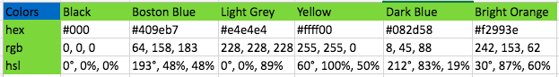

[Back to top ⇧](#the-euro-football-quiz)

* I took a little time testing different fonts and colours and at one point decided to use Yellow for the header and footer backgrounds. This looked good but looked to similar to other well-known brands like Aviva and EE. I therefore, reverting back to using a teal/turquoise with a light grey which looks elegant and attractive.

* The homepage and feedback page has the least information. The homepage is designed as a strong landing page to gain the users attention with an eye-catching image, summary of what the site is about and a timeline of interesting moments relating to the football tournament. The user then can move forward to the tournaments page or quiz page. I believe that this site and format I have selected will work well on all screen sizes and particular well on mobile screen as it can be used to quickly test someone's knowledge on the go, for example, out with friends, whilst travelling to pass the time etc.  

[Back to top ⇧](#the-euro-football-quiz)

## Design Process page by page

### Header design

* The header across all pages is the same.
* The test logo 'THE EURO FOOTBALL QUIZ' is at the top left in uppercase using the font-family: 'Bebas Neue', cursive (fall back). The color is Boston Blue and when hovered over will turn Dark Blue to show its a link to the homepage.
* The navigation bar is positioned to the right and highlights all pages for the user to click on. The font styling is the default font-family: 'Mukta', sans-serif (fall back). The color for the page titles within the navigation bar is the default Boston Blue. When hovering over any of the page titles the color of the page title changes to Dark blue and increased in size from 20px to 30px. Whichever page the user is on will be shown in the navigation bar with the relevant page title shown in bright orange.
* The header is fixed to the top so that it will travel with the user as they scroll down the webpage. 
* The navigation bar is titled with pages on large screen sizes. On smaller screen sizes there is a burger bar menu and when clicked on users will see the page titles which are centred. The menu can be collapsed when clicked on again for good user experience. 
* Bootstrap5 was used to create this header navigation bar with text logo.
* I decided to add the bootstrap class container-fluid to the header for improved responsiveness on all screen sizes.
* One of the last features I added to the head element is a football icon that sits in the web browser tab which shows the user that the website is football focused. 

[Back to top ⇧](#the-euro-football-quiz)

### Footer design

* The footer holds five social media icons found using <a href="https://www.fontawesome.com" target="_blank">Font Awesome</a> for the images. The images sit inside a small round light grey background. The color of all images is dark blue and when hovering over any of the icons the background color changes to yellow. Each icon image is linked to the relevant websites and when clicked will take the user to the whichever social media platform chosen. A new webpage tab will open when taking the user to whichever social media icon is clicked. This is done so that the user can return to this website easily. 
* Below the social media icons there is some copyright text in the Dark Blue color. 
* The following code is used to create the official copy right logo symbol - &copy;

[Back to top ⇧](#the-euro-football-quiz)

### Homepage design

* I wanted to keep the homepage simple with a central welcome header and a striking image of a football ground full of fans showing how popular the sport is. I found the perfect <a href="https://www.pexels.com/photo/people-sitting-on-stadium-seats-3991976/" target="_blank">Image</a> at <a href="https://www.pexels.com" target="_blank">Pexels</a>. I decided to add a thin yellow boarder around the image to make it stand out more and with a little curve finish to each corner this image now looks great. 

* On bigger screen sizes users will see to the right of the hero image a sub title paragraph and a timeline of important moments throughout the tournament's history in chronological order. All information in the timeline is also a link to an external source for more reading. This is indicated when a user hovers over any timeline sentence, to find it turns yellow. On smaller screen sizes the timeline is below the image for better UX. All external sources of information on the timeline were sourced using Wikipedia. 

* I originally placed three buttons below the hero image and timeline. These buttons would take users to the tournament, quiz or feedback pages. All buttons were identical in size, shape and color (Dark blue background with boston blue font). I decided that with lots of button coming up on the quiz page I thought less buttons would be better on this page and therefore the key button I kept and positioned after the timeline is the 'Find out more' button which is linked to the tournament.html page. This guides the user naturally to the next page in order to read more about the Euro tournamenets. 

* When a user hovers over this button the background color changes to Yellow and the font color changes to Dark Blue. This indicates to the user that they will move to another page if clicked.

* Bootstrap column grid and Media queries is used to make sure that across all screen sizes the image, timeline, text and button work well. 

[Back to top ⇧](#the-euro-football-quiz)

### Tournaments page design

* The tournament page is where you will find all the past, present and future information about this football tournament. I wanted to make sure that the design of this page was easy to navigate through and therefore I used the Bootstrap grid system, rows and columns to position images, sub headers, paragraphs, media clip and google map.

* I kept the color scheme, fonts and font sizing the same as the homepage for good overall UX.

* Below the sub header at the top of the page, users will see the Euro 2020 logo with paragraphs giving an introduction and general information about the tournament.
This <a href="https://www.google.com/search?q=uefa+euro+2020+trophy&tbm=isch&ved=2ahUKEwif26nwlIjxAhX-gc4BHRXLDEMQ2-cCegQIABAA&oq=uefa+euro+2020+trophy&gs_lcp=CgNpbWcQAzICCAAyBAgAEBgyBAgAEBg6BAgjECc6BggAEAcQHjoGCAAQCBAeUMZoWKSMAWCajQFoBnAAeACAAUWIAbkGkgECMTSYAQCgAQGqAQtnd3Mtd2l6LWltZ8ABAQ&sclient=img&ei=XHO_YJ-9L_6Dur4PlZazmAQ&bih=821&biw=1440&rlz=1C5CHFA_enGB821GB821#imgrc=JJyZWk_7mb5qgM" target="_blank">image</a> was sourced using <a href="https://en.wikipedia.org/wiki/UEFA_Euro_2020" target="_blank">Wikipedia</a>. The content for the paragraphs were also sourced using <a href="https://en.wikipedia.org/wiki/UEFA_European_Championship" target="_blank">Wikipedia</a>.

* Below there is more information about who hosted the tournament since it started in 1960. Half way through the paragraphs there is an image of the winning trophy being displayed. The <a href="https://www.uefa.com/uefaeuro-2020/news/0258-0e51de1a172f-12472925ce41-1000/" target="_blank"> trophy image</a> was sourced using the official UEFA Euro 2020 website. The content for this part of the page was sourced from <a href="https://www.worldsoccer.com/euro-2020/past-european-championship-hosts-409195" target="_blank">World Soccer</a>.

* Below is a media clip showing all winners from 1960 to 2016. The media clip was sourced on YouTube. I made sure this took up the whole row using Bootstrap columns accordingly with good space either side. The <a href="https://www.youtube.com/watch?v=F6RTd4TJOhA" target="_blank">media clip</a> was sourced from <a href="https://www.youtube.com/" target="_blank">YouTube</a> with thanks to YouTube channel <a href="https://www.youtube.com/channel/UCQnyQjCjufnqKL4dKBuqlOQ" target="_blank">Julian 87</a>. 

* Below is a sub header and an ordered list (alphabetical) of cities that are due to host the Euro 2020. On the same row and to compliment the list there is an interactive google map. JavaScript has been used to create this feature. The file name for this is maps.js. The map is rendered using an API key from the Google Maps Platform. The map also has markers and clusters in place showering users where the hosting cities are in Europe. The content for this row was sourced from the official <a href="https://www.uefa.com/uefaeuro-2020/news/0255-0d9f2f2c93bf-ad932fd5ee55-1000--euro-all-you-need-to-know/" target="_blank">UEFA Euro 2020</a> website.

* Below the map there is two short paragraphs confirming where future tournaments will be held. I sourced this information for the <a href="https://en.wikipedia.org/wiki/UEFA_Euro_2024" target="_blank">Euro 2024</a> and <a href="https://en.wikipedia.org/wiki/UEFA_Euro_2028" target="_blank">Euro 2028</a> on Wikipedia.

* Below the future tournaments paragraph users will find a button to click on which takes them to the quiz.html page. This button is the same as the button on the homepage with a Dark blue background with boston blue font.

* When a user hovers over this button the background color changes to Yellow and the font color changes to Dark Blue. This indicates to the user that they will move to another page if clicked.

* I used Horizontal Rules and Line Breaks to separate all the sections within the body of this webpage to make sure it was easier to read and to achieve better UX. Also used is bootstrap container-fluid on all rows with paragraphs for structure and consistency. 

* On large screen sizes the layout is split. Images and paragraphs are even across the screen. On smaller screen sizes everything is set vertically with images, paragraphs, media clip and google map covering the whole of the width of the screen. 

[Back to top ⇧](#the-euro-football-quiz)

### Quiz page design

* Designing this page was the most challenging part of this project. I started with just adding a sub-header with questions and three possible answers to select from as each question would be multiple choice. I separated each question and answers with a horizonal line but there was something missing. I decided to add an image clue to each question which not only would assist the user but also offers a better overall look. 

* I kept the color scheme and overall structure the same as the homepage and tournament page for good overall UX.

* The questions were written in h5 header HTML with the answers in the form of buttons. All buttons have been given unique IDs for the purpose of JavaScript. 

* I structured each question and selection of answers on the left side of laptop screen sizes and above and made sure that on smaller screen sizes the format would be vertical with the question first then 3 possible answer buttons below with the image clue to finish. The horizontal line is very important here to separate each question/answers/image. This was done using Bootstrap columns. 

* Using JavaScript has allowed me to change and remove relevant answer buttons. When an answer button is selected that button turns and stays bright orange if correct or light grey if incorrect. When one answer is selected the other two answers disappear. Using HTML IDs and the JavaScript remove method with the 'click function' achieves this.

* All images were found online from different sources. Full details can be found in the [credits](#credits) section with links to each source. 

* Below the questions, users will find the submit answers button called 'see your score' to click on. This button is larger than all other buttons and is in a different background color of bright orange (#f2993e). JavaScript methods - 'hasClass', 'addClass' and 'show' has been used so that when the 'see your score' button is clicked the users score becomes visible along with optional 'try again' and 'answers' buttons for the user to click on. The 'results' button background color is bright orange. The 'try again' and 'answers' button has a light grey background and when hovered turns yellow to show users that they can click these buttons. 

* Below the 'results', 'try again' and 'answers' buttons, users will find another button to click on. This button is in Dark blue background with boston blue font and will take the user to the feedback.html page to complete. When a user hovers over this button the background color changes to Yellow and the font color changes to Dark Blue. This indicates to the user that they will move to another page if clicked.

* I used Horizontal Rules and Line Breaks to separate all the questions/answers within the body of this webpage to make sure it was easy to navigate through offering users the best level of experience.

* JavaScript has been used on this page to make sure that users can click their answers and obtain their score immediately at the press of a button. For reference the JavaScript file for this page is quiz.js

* I was going to include down arrows as a feature on this page. The idea was to have down arrows as links below each question so that the user could click. This would then take the user to the next question. I decided not to include this feature at this stage. It may be a feature that could be introduced as more questions are added over time as this would be more relevant to keep the user connected to the right part of the page whilst answering the quiz questions.  

[Back to top ⇧](#the-euro-football-quiz)

### Feedback page design

* The page starts with a sub header above the form as a title

* This page simply has a basic contact form for users to complete with their name, email and feedback required to submit.

* I used Bootstrap to create the form with Bootstrap row and columns for responsive design on all screen sizes.

* All three sections of the form i.e., name, email and feedback text-area required relevant information. If a user attempted to submit the form with information missing, they will be shown an error message (please fill in this field). This is in place to make sure that all forms are received with complete information. The code applied within the first tag of all three elements of the form is the 'required' attribute. 

* I decided to imbed the form on the webpage and not have it sit off the page. This I believe gives better UX. 

* The submit button below is identical in size, shape and color to all other buttons throughout the website's homepage and tournament page. For reference these buttons have a dark blue background with boston blue font. The background color changes to yellow and the font color of the text changes to dark blue when hovered over showing the user the button can be clicked when the information in the form is added correctly. 

* The form looked a little basic, however, at the same time I didn't want to overload this page with too much information. I therefore looked at changing the style of the form boxes. I added a yellow color border and a border radius to curve the corners of the boxes. The boxes are shaded with the same light grey color as the header background and only turns back to white when a user has clicked on a box to type. 

* JavaScript used for this page was sourced from <a href="https://www.emailjs.com/" target="_blank">EmailJS</a> to create the three boxes, 'name', 'email' and 'feedback' with the form. I added some additional JavaScript to the template to give users a bespoke message in the modal when the form is submitted successfully. This message includes the users name making the message personal to them i.e., 'Thank you for your feedback 'John'. We hope you enjoyed the quiz!' If the feedback form isn't submitted correctly for whatever reason, the user will see a different Modal message come up i.e., 'Sorry 'John' something went wrong. Please try submitting your feedback again!' Whatever name the user puts in the form will be used within the modal message shown. 

* Once the user reads the modal message and clicks the close button, the form refreshes. I used a click function and the location.reload method to achieve this. This was sourced using <a href="https://stackoverflow.com/questions/5404839/how-can-i-refresh-a-page-with-jquery" target="_blank">Stack overflow</a> to help with reloading the form when a user submits their details. 

[Back to top ⇧](#the-euro-football-quiz)

### Answers page design

* This page isn't included in the navigation bar at the top of all other pages as its only available to click on once a user has completed the quiz and submitted their answers. 

* The structure of this page is very similar to the quiz page with the layout of the questions, correct answer and relevant clue image. 

* The purpose of this page is to show just the correct answers. I chose to highlight the answers with a bright orange background color. 

* At the bottom of the page users can click the 'Try Again' button where the user can try the quiz again. When the user hovers over this button the background color changes from light grey to yellow to show its a clickable button. 

* Below the 'Try Again' button, users will find another button to click on. This button is in Dark blue background with boston blue font and will take the user to the feedback.html page to complete. When a user hovers over this button the background color changes to Yellow and the font color changes to Dark Blue. This indicates to the user that they will move to another page if clicked.

[Back to top ⇧](#the-euro-football-quiz)

### Media Queries

* On smaller screen sizes the logo at the top left of all pages and the navbar toggle has been reduced in size to make sure that on very small mobile screens they fit on one row. Without this code the burger bar menu drops to a new row below the logo and doesn't look good. 

* The hero image size has been adjusted according to different screen sizes.

* The euro trophy image on the tournaments page has been adjusted in size and positioning for the purpose of different screen sizes. 

* The six quiz clue images on the quiz.com page has been adjusted in size with top margin added on different screen sizes for better UX.

* The font size for the text on the timeline found on the home page is adjusted to fit better on smaller screen sizes.

* Margins have been added to certain buttons on the quiz page for larger screen sizes.

* On certain screen sizes I applied relevant padding and margins to buttons and the form.

* Within the footer the copyright text font size has been adjusted on small screen sizes.

* On large screen sizes above 2000px a lot of adjustments have been made throughout the website to make it more accessible on large screens. 

[Back to top ⇧](#the-euro-football-quiz)

## Features

### Existing features

#### All pages
* Text Logo at the top left of the header which is also a link to the homepage
* A navigation menu bar at the top right of the header which shows page links to all pages accept for the answers.html page.
* Five icon links to social media sites i.e. Facebook, Instagram, Twitter, Spotify and YouTube. 
* Copyright text.
* In the web browser the tab shows a boston blue football icon with the title 'The Euro Football Quiz'

#### Homepage
* A main header - Welcome to The Euro Football Quiz.
* Hero image of a football stadium.
* Timeline sub header.
* Timeline of key moments in history of the tournament.
* A 'find out more' link button to move to the next page - tournaments.html.

#### Tournaments page
* A sub header - 'The History, Trophy, Hosts, and Future Tournaments'.
* Official Euro 2020 logo.
* Four paragraphs of content about the football tournament.
* Six paragraphs of content about the history of tournaments.
* An image of the official trophy.
* Media clip supported by YouTube of all the tournaments winners.
* Sub header with a list of cities that's hosting Euro 2020.
* Google map with markers showing where the cities are in Europe based on the list mentioned.
* Sub header referencing future tournaments.
* Two short paragraphs referencing 2024 and 2028 tournaments.
* A 'take the quiz' link button to move to the next page - quiz.html.

[Back to top ⇧](#the-euro-football-quiz)

#### Quiz page
* A sub header - 'The Quiz'.
* Six questions with three multiple choice answers.
* All questions come with an image clue.
* A 'SEE YOUR SCORE' button to click on which does the following: - 
    - reveal the users score.
    - reveal an 'ANSWERS' button which takes the user to a hidden webpage - answers.html.
    - reveal a "TRY AGAIN' button which restarts the quiz from the beginning.
    - reveal a 'Leave feedback' button which takes the user to the feedback.html page.

#### Feedback page
* A sub header - 'Give your feedback'.
* Feedback form for users to complete - name, email and feedback.
* 'Leave feedback' button to submit feedback.
* If information is missing when the form is submitted the user will see an error message - 'Please fill in this field'.
* Upon successfully submitting the feedback form the user will receive the following message - 'Thank you for your feedback {name}. We hope you enjoyed the quiz!'.
* If the form is submitted with all fields completed but doesn't deliver properly the user will see the following message - 'Sorry {name} something went wrong. Please try submitting your feedback again!'.
* In the message box the user will need to click the 'close' button at the bottom right which will close the message and reset the fields in the form. 

#### Answers page
* A sub header - 'The Answers'.
* The same six questions from the quiz.html page with the correct answer buttons shown in orange.
* All questions with the answers come with an image clue for reference.
* A 'TRY AGAIN' button to click on to try the quiz again. 
* A 'Leave feedback' button which takes the user to the feedback.html page

[Back to top ⇧](#the-euro-football-quiz)

### Features Left to Implement
* More questions in the form of categories based on each tournament.
* More questions randomly chosen using a JavaScript loop with the random method.
* Live chat facility for fans to talk to each other
* A news page giving fans up to date information about players fitness etc.
* Google Map marker labels upon clicking each marker on the map
* 404 error page to be added. I found the following <a href="https://docs.github.com/en/pages/getting-started-with-github-pages/creating-a-custom-404-page-for-your-github-pages-site" target="_blank">guide</a> on Github to complete this. I wanted to add this to the site but I didn't have enough time left to do it on this project. 

[Back to top ⇧](#the-euro-football-quiz)

## Technology Used

### Languages
* <a href="https://en.wikipedia.org/wiki/HTML" target="_blank">HTML5</a> - The HyperText Markup Language used to provide content to the website. 
* <a href="https://en.wikipedia.org/wiki/CSS" target="_blank">CSS3</a> - Cascading Style Sheet used to provide style to all web pages with fonts, colors, images, positioning and unique features like the timeline on the homepage.
* <a href="https://en.wikipedia.org/wiki/JavaScript" target="_blank">JavaScript</a> - used to add interactive behaviour to a static website.  

### Frameworks and libraries
* <a href="https://en.wikipedia.org/wiki/JQuery" target="_blank">JQuery</a> - used as a JavaScript library to assist with Javascript to reduce coding and maximise interaction by manipulating the <a href="https://en.wikipedia.org/wiki/Document_Object_Model" target="_blank">DOM</a> (Document Object Model).
* <a href="https://getbootstrap.com/" target="_blank">Bootstrap 5.0</a> - Used for the navigation menu, buttons, grid system, rows, columns, feedback form, certain classes that had inbuilt styling and to structure the overall website.
* <a href="https://developers.google.com/maps" target="_blank">Google Maps Platform</a> - Used to setup a interactive google map on the website with an API key.  

### Other technologies
* <a href="https://codeinstitute.net/" target="_blank">Code Institute</a> - I reverted back to lessons and videos to help with some coding.
* <a href="https://slack.com/intl/en-gb/" target="_blank">Slack</a> - To communicate with my mentor and other students to get help at times.
* <a href="https://developer.chrome.com/docs/devtools/" target="_blank">Chrome DevTools</a> - This tool was very useful for amending code, finding where bugs were coming from and help with JavaScript code and console errors during the time of being the feedback form page. Used to examine the overall performance of the site with Lighthouse as well. 
* <a href="https://balsamiq.com/wireframes/?gclid=CjwKCAjw6fCCBhBNEiwAem5SO0TfrA7AKJnwXKFEJStjRK5qFYRfJ7jLW6Vdt4F1CdcujCZRm9Zr7xoC3oUQAvD_BwE" target="_blank">Balsamiq</a> -  Used to create wireframes for all pages on all screen sizes. 
* <a href="https://fontawesome.com/" target="_blank">Font Awesome</a> - I used five 'free of charge' icons across all pages of the website footer.
* <a href="https://pexels.com/" target="_blank">Pexels</a> - I used one "free' <a href="https://www.pexels.com/photo/people-sitting-on-stadium-seats-3991976/" target="_blank">image</a> from this site for the homepage.
* <a href="https://fonts.google.com/" target="_blank">Google Fonts</a> - I used two font families on my website. I used the font Mukta with sans-serif and fallback for most of the website content and Bebas Neue with cursive as a fallback for the text logo. Fallback will only work if the main fonts, Mukta and Bebas Neue failed.
* <a href="https://www.lipsum.com/feed/html" target="_blank">Lipsum</a> - Used to copy and paste Lorem Ipsum text at the beginning of my project to assist in the structure and layout.
* <a href="https://gitpod.io/" target="_blank">Gitpod</a> - Used to complete my HTML, CSS and JavaScript/JQuery coding for my MS2 project.
* <a href="https://github.com/" target="_blank">Github</a> - GitHub is used to store the projects code after being pushed from Git.
* <a href="https://git-scm.com/" target="_blank">Git</a> - Git was used for version control by using the Gitpod terminal to commit to Git and Push to GitHub.
* <a href="https://validator.w3.org/" target="_blank">W3C Markup Validation Service</a> - Used to test all HTML coding for all five pages.
* <a href="https://jigsaw.w3.org/css-validator/" target="_blank">W3C CSS Validation Service</a> - Used to test all CSS coding.
* <a href="https://jshint.com/" target="_blank">JS Hint</a> - Used to test all Javascript coding.
* <a href="https://www.emailjs.com/" target="_blank">Email JS</a> - Used to 
send email directly from JavaScript - free of charge for up to 200 emails per month.

[Back to top ⇧](#the-euro-football-quiz)

## Testing

Testing information can be found in a separate 
[Testing document](TESTING.md)

## Deployment 
(Date this project was deployed: 25th June 2021)

### Github pages
The project was deployed to GitHub Pages doing the following: -

1. <a href="https://github.com/liamwalsh1980/Milestone-Project-2" target="_blank">MS2 Project GitHub Repository</a>

1. At the top of the Repository I clicked the settings option on the menu.

1. I checked that the name of the Repository was correct - Milestone-Project-2

1. I scrolled down the settings page to the GitHub Pages Section where there now is a dedicated tab for the Pages settings. 

1. I clicked on the new tab - Check it out here!

1. Under Source, I clicked the dropdown option called none and selected Master Branch.

1. The page automatically refreshed with a URL for me to use to show my live site.

1. I Scrolled down the page to obtain the published site link to enable me to share with others. 

1. <a href="https://liamwalsh1980.github.io/Milestone-Project-2/" target="_blank">Click here to view The Euro Football Quiz project live</a>

For a more in-depth guide about Configuring a publishing source from Github pages please <a href="https://docs.github.com/en/github/working-with-github-pages/configuring-a-publishing-source-for-your-github-pages-site" target="_blank">click here</a>.

[Back to top ⇧](#the-euro-football-quiz)

### Forking the GitHub Repository
By forking the GitHub Repository, you can make a copy of my original repository on your GitHub account to view and/or make changes without affecting the original repository by doing the following: -

1. Log in to GitHub and locate the GitHub Repository
1. At the top of the Repository click the settings option on the menu, locate and click the "Fork" Button which is at the top right of the page.
1. You should now have a copy of the original repository in your GitHub account.

For a more in-depth guide about how to Fork a repo please <a href="https://docs.github.com/en/github/getting-started-with-github/fork-a-repo" target="_blank">click here</a>.

[Back to top ⇧](#the-euro-football-quiz)

### Making a Local Clone

1. Log in to GitHub and locate the GitHub Repository
1. Next to the green Gitpod button you will see the dropdown button "code". Click this to open up the option to clone.
1. To clone the repository using HTTPS, under "Clone with HTTPS", copy the link.
1. Open Git Bash
1. Change the current working directory to the location where you want the cloned directory to be made.
1. Type git clone, and then paste the URL you copied in Step 3.
    - $ git clone <a href="https://github.com/liamwalsh1980/Milestone-Project-2" target="_blank">Click here</a>
1. Press Enter. Your local clone will be created.

[Back to top ⇧](#the-euro-football-quiz)

## Credits

### Images
* Hero image on the homepage - Photo by Dom Le Roy from Pexels
<a href="https://www.pexels.com/photo/people-sitting-on-stadium-seats-3991976/" target="_blank">Click here to view image from its source</a>

* <a href="https://en.wikipedia.org/wiki/UEFA_Euro_2020" target="_blank">Wikipedia</a> page where the
<a href="https://www.google.com/search?q=euro+2020+images&rlz=1C5CHFA_enGB821GB821&source=lnms&tbm=isch&sa=X&ved=2ahUKEwiOvtGLoqnxAhWhCmMBHUhkCQwQ_AUoAXoECAEQAw&biw=1440&bih=821#imgrc=JJyZWk_7mb5qgM" target="_blank">Euro 2020 logo</a> came from.

* The <a href="https://www.uefa.com/uefaeuro-2020/news/0258-0e51de1a172f-12472925ce41-1000/" target="_blank"> trophy image</a> was sourced from the official UEFA Euro 2020 website.

* Quiz Question 1 - <a href="https://cultofcalcio.com/the-history-of-the-uefa-euro-1960-the-humble-beginnings/" target="_blank">image</a> 

* Quiz Question 2 - <a href="https://www.thesundaily.my/sport/romania-expects-quarter-full-stadium-for-euro-2020-games-BE7314838" target="_blank">image</a>

* Quiz Question 3 - <a href="https://www.vecteezy.com/vector-art/2153351-european-football-2020-tournament-flag-set-vector-country-flag-set-for-soccer-championship" target="_blank">image</a>

* Quiz Question 4 - <a href="https://www.eurosport.co.uk/football/euro-icons-1992-peter-schmeichel-the-great-dane_sto7776495/story.shtml" target="_blank">image</a>

* Quiz Question 5 - <a href="https://www.google.com/search?q=euro+2028+&tbm=isch&ved=2ahUKEwjZwbGnvpDxAhUE2xoKHVn9CNkQ2-cCegQIABAA&oq=euro+2028+&gs_lcp=CgNpbWcQAzICCAAyAggAMgQIABAeMgYIABAFEB4yBggAEAUQHjIECAAQHjIECAAQGDIECAAQGDIECAAQGDIECAAQGFDptBlY6bQZYNm9GWgAcAB4AIABlwGIAZcBkgEDMC4xmAEAoAEBqgELZ3dzLXdpei1pbWfAAQE&sclient=img&ei=jNDDYNlLhLZr2fqjyA0&rlz=1C5CHFA_enGB821GB821#imgrc=8qk901TzJpe8HM" target="_blank">image</a>

* Quiz Question 6 - <a href="https://en.wikipedia.org/wiki/UEFA_Euro_2004#/media/File:UEFA_Euro_2004_logo.svg" target="_blank">image</a>

[Back to top ⇧](#the-euro-football-quiz)

### Icons

* <a href="https://gauger.io/fonticon/" target="_blank">Football Icon</a> positioned in the head of each HTML page which shows up within the browser tab, thanks to <a href="https://github.com/devgg" target="_blank">Florian Gauger</a>.

* Social media icons sourced from <a href="https://fontawesome.com/" target="_blank">Font Awesome</a> for the footer on every HTML page.
    * <a href="https://fontawesome.com/v5.15/icons/facebook-f?style=brands" target="_blank">Facebook</a>
    * <a href="https://fontawesome.com/v5.15/icons/instagram?style=brands" target="_blank">Instagram</a>
    * <a href="https://fontawesome.com/v5.15/icons/twitter?style=brands" target="_blank">Twitter</a>
    * <a href="https://fontawesome.com/v5.15/icons/spotify?style=brands" target="_blank">Spotify</a>
    * <a href="https://fontawesome.com/v5.15/icons/youtube-square?style=brands" target="_blank">Youtube</a>

### Content
* I used Wikipedia for all European Football history
<a href="https://en.wikipedia.org/wiki/UEFA_European_Championship" target="_blank">click here to see the page</a>

* I sourced the paragraph content for previous hosts from 
<a href="https://www.worldsoccer.com/euro-2020/past-european-championship-hosts-409195" target="_blank">World Soccer</a> 

* I sourced the content to support the Google Map image in the tournament page using <a href="https://www.uefa.com/uefaeuro-2020/news/0255-0d9f2f2c93bf-ad932fd5ee55-1000--euro-all-you-need-to-know/" target="_blank">UEFA Euro 2020</a> website.

* I sourced the content for <a href="https://en.wikipedia.org/wiki/UEFA_Euro_2024" target="_blank">Euro 2024</a> and <a href="https://en.wikipedia.org/wiki/UEFA_Euro_2028" target="_blank">Euro 2028</a>  tournaments from Wikipedia.

### Media Clip
* I sourced the <a href="https://www.youtube.com/watch?v=F6RTd4TJOhA" target="_blank">media clip</a> from <a href="https://www.youtube.com/" target="_blank">YouTube</a> with thanks to <a href="https://www.youtube.com/channel/UCQnyQjCjufnqKL4dKBuqlOQ" target="_blank">Julian 87</a> 

### JavaScript

* sendEmail.js - the location.reload method was sourced using <a href="https://stackoverflow.com/questions/5404839/how-can-i-refresh-a-page-with-jquery" target="_blank">Stack Overflow</a>. This helped with making sure that when the form was completed the page reloaded properly after a user has finished submitting their details.    

* sendEmail.js - I sourced code from <a href="https://www.w3schools.com/jsref/prop_style_display.asp" target="_blank">W3 Schools</a> to help with form to function properly. 

* maps.js - i sourced the Latitude and Longitude units for the relevant cities in Europe thats hosting the Euro 2020 tournament using a general <a href="https://www.latlong.net/place/seville-center-of-interpretation-seville-spain-23323.html" target="_blank">google</a> search.

<a href="https://www.latlong.net/place/seville-center-of-interpretation-seville-spain-23323.html" target="_blank">google</a>

[Back to top ⇧](#the-euro-football-quiz)

## Acknowledgements    

* A big 'thank you' to my Mentor - Seun Owonikoko 
* Code Institute tutors
* The Slack community 
* My family for taking the time to have a go at the quiz and provide good feedback

## Notes

This website is for educational purposes only and created for my Code Institute Interactive Front-End Development Milestone Project (MS2)

### End of README Document
[Back to top ⇧](#the-euro-football-quiz)