# The Euro Football Quiz 

## Code Institute - Milestone Project 2 (testing)

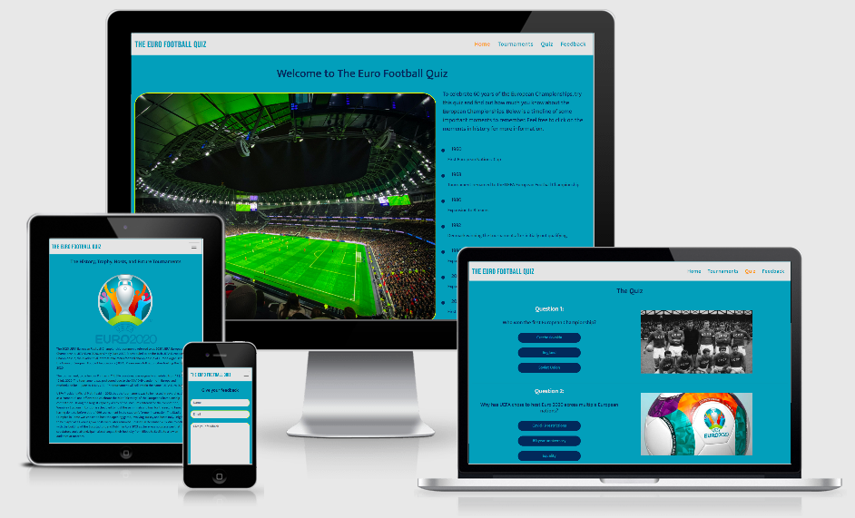

<a href="https://liamwalsh1980.github.io/Milestone-Project-2/" target="_blank">Click here to view The Euro Football Quiz live</a>

## Table of contents
1. [Testing](#testing)
    * [Screen sizes](#screen-sizes)
        * [Large screens](#large-screens)
        * [Small screens](#small-screens)
    * [Navigation bar menu](#navigation-bar-menu)
        * [Full screen navigation bar](#full-screen-navigation-bar)
        * [Hamburger navigation bar](#hamburger-navigation-bar)
    * [Media Clip](#media-clip)
        * [Mobile screen](#mobile-screen)
        * [Tablet screen](#tablet-screen)
        * [Desktop screen](#desktop-screen)
        * [Full screen](#full-screen)
    * [User stories tested ](#user-stories-tested)
        * [Story 1](#story-1)
        * [Story 2](#story-2)
        * [Story 3](#story-3)
        * [Story 4](#story-4)
        * [Story 5](#story-5)
    * [W3C Markup Validation Service](#w3c-markup-validation-service)
        * [Homepage tested](#homepage-tested)
        * [Tournament page tested](#tournament-page-tested) 
        * [Quiz page tested](#quiz-page-tested)
        * [Feedback page tested](#feedback-page-tested)
        * [Answers page tested](#answers-page-tested)
    * [W3C CSS Validation Service](#w3c-css-validation-service)
        * [CSS coding tested](#css-coding-tested)
    * [JS Hint Javascript code validator](#js-hint-javascript-code-validator)
        * [Maps.js](#maps.js)
        * [Quiz.js](#quiz.js)
        * [sendEmail.js](#sendemail.js)
    * [Web Browsers](#web-browsers)
        * [Google Chrome](#google-chrome)
        * [Apple Safari](#apple-safari)
        * [Microsoft Edge](#microsoft-edge)
        * [Mozilla Firefox](#mozilla-firefox)
    * [Testing responsiveness](#testing-responsiveness)
        * [Mobile screenshots](#mobile-screenshots)
        * [Tablet screenshots](#tablet-screenshots)
        * [Desktop screenshots](#desktop-screenshots)
        * [Large Desktop screenshots](#large-desktop-screenshots)
    * [Lighthouse testing](#lighthouse-testing)
        * [Desktop results](#desktop-results)
        * [Mobile results](#mobile-results)
    * [Issues found](#issues-found)
        * [API key](#api-key)
        * [Quiz images](#quiz-images)
        * [Feedback form](#feedback-form)
        * [Modal issues](#modal-issues)
        * [EmailJS](#emailjs)
    * [Further testing](#further-testing)
        * [Mobile first](#mobile-first)
        * [External links](#external-links)
        * [Internal links](#internal-links)
    * [Bugs outstanding](#bugs-outstanding)

Return to my [README.md](README.md) 

[Back to top ⇧](#the-euro-football-quiz)

## Testing

### Screen sizes
* I decided to use Bootstrap grid (rows and columns) to structure the website offering good UX on all screen sizes. On Laptop and Deskop screens (large) the layout is different to tablet and mobile screens (small). 

#### Large screens

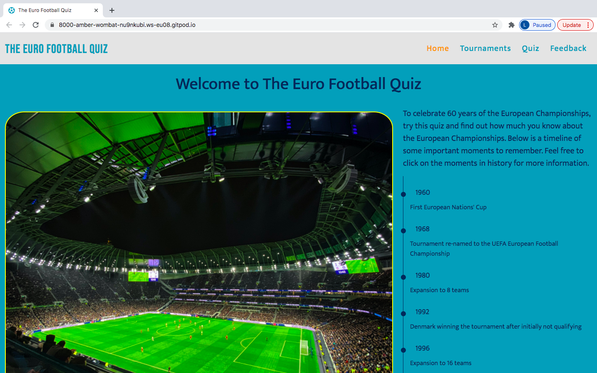

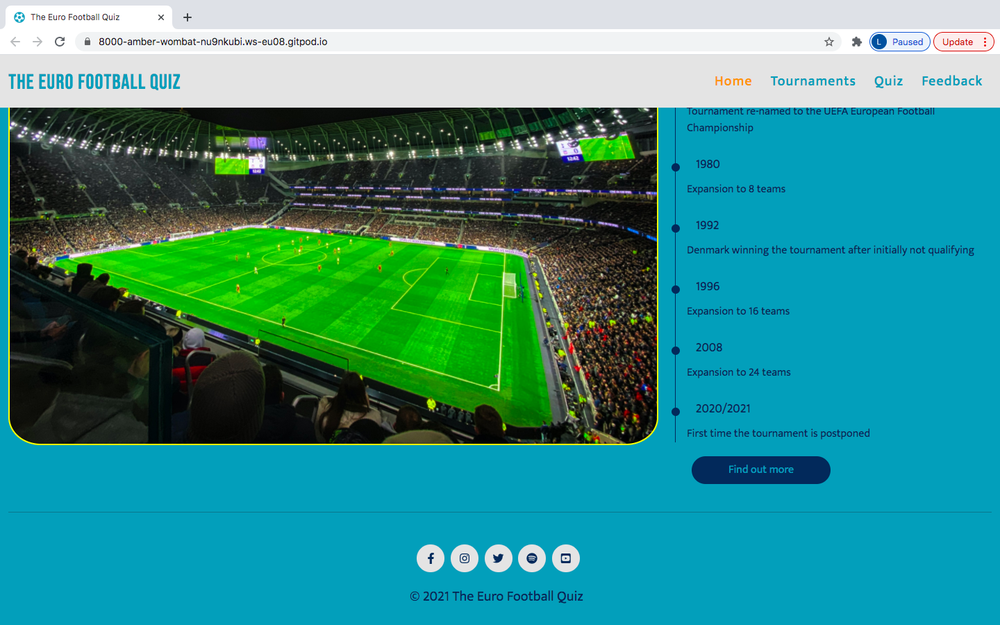

#### Small screens

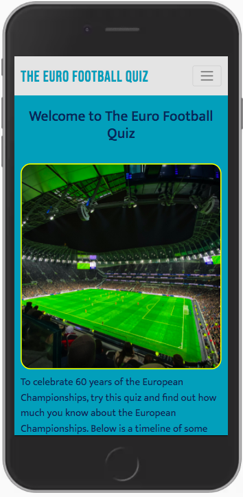

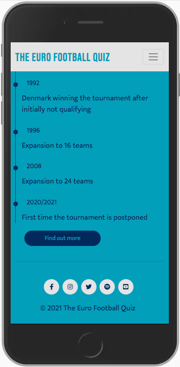

[Back to top ⇧](#the-euro-football-quiz)

### Navigation bar menu
#### Full screen navigation bar
* On big screens the navigaton bar has page titles. Any page title thats hovered over increases slightly in size. I tested different options i.e. underlining the selected page, however, instead i dediced to go for different colors on pages selected or hovered over as well as the size increase as mentioned.

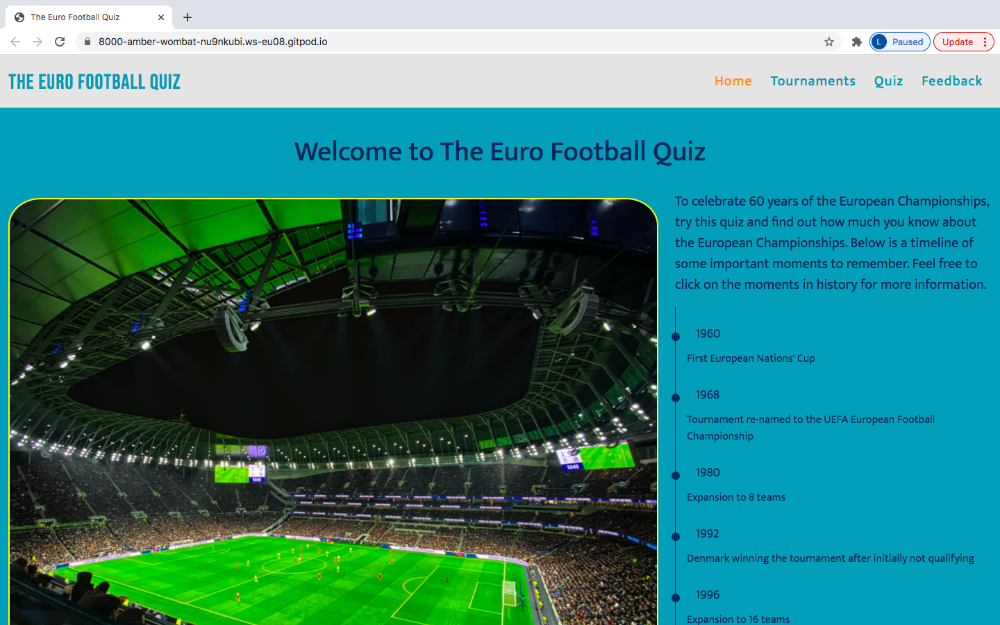

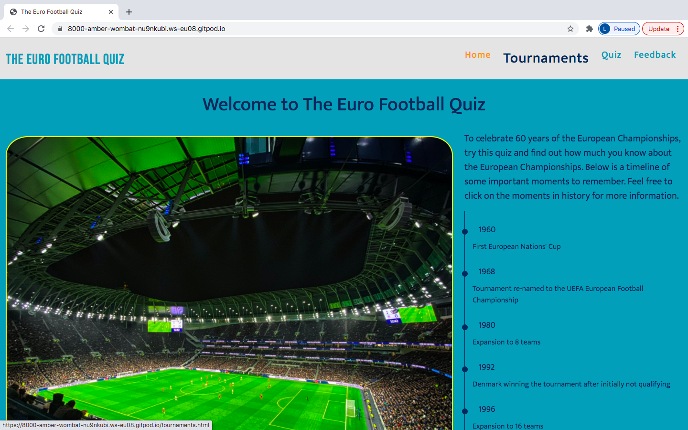

#### Hamburger navigation bar
* When testing the navigation bar i wanted to make sure that it collapses into a hamburger menu (3 horizontal bars) on smaller screens. This is common practice to have and offers the user the option to look and click onto another page within the website.

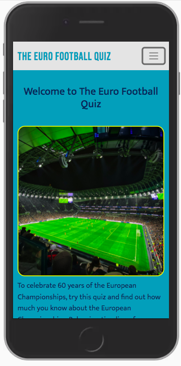

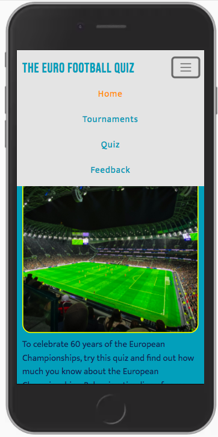

* On smaller mobile screen sizes i needed to adjust the size of the logo text and hamburger navbar to fit as the hamburger menu. I used media queries to to acheive this. 

    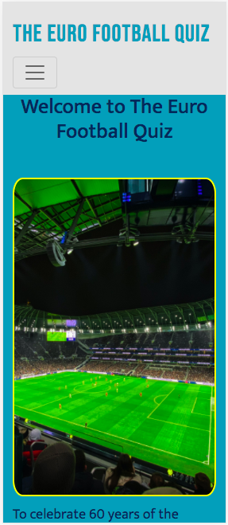

    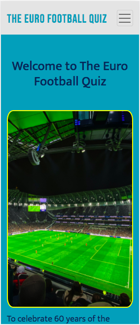

[Back to top ⇧](#the-euro-football-quiz)

### Media clip

* I tested the media clip on the tournaments.html page on all screen sizes along with full screen size to make sure it loaded and played successfully. 

#### Mobile screen
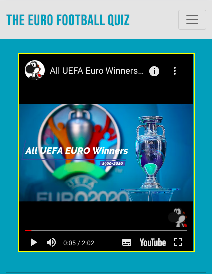

#### Tablet screen
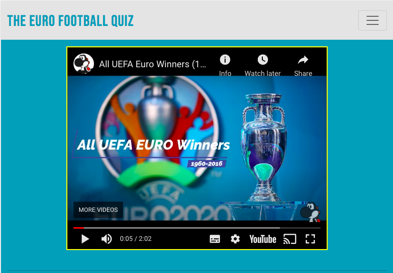

#### Desktop screen
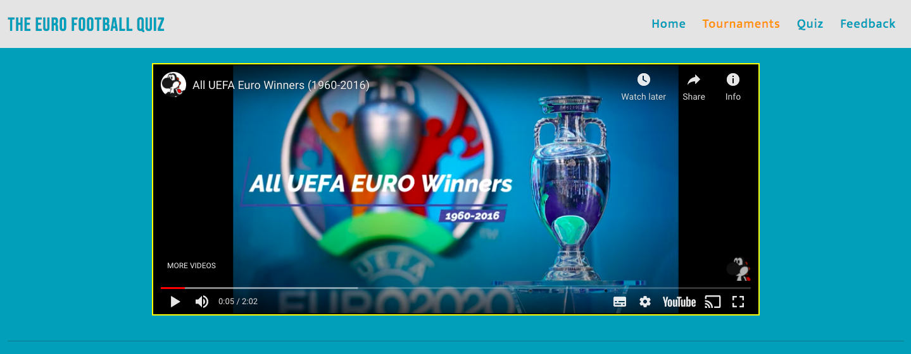

#### Full screen
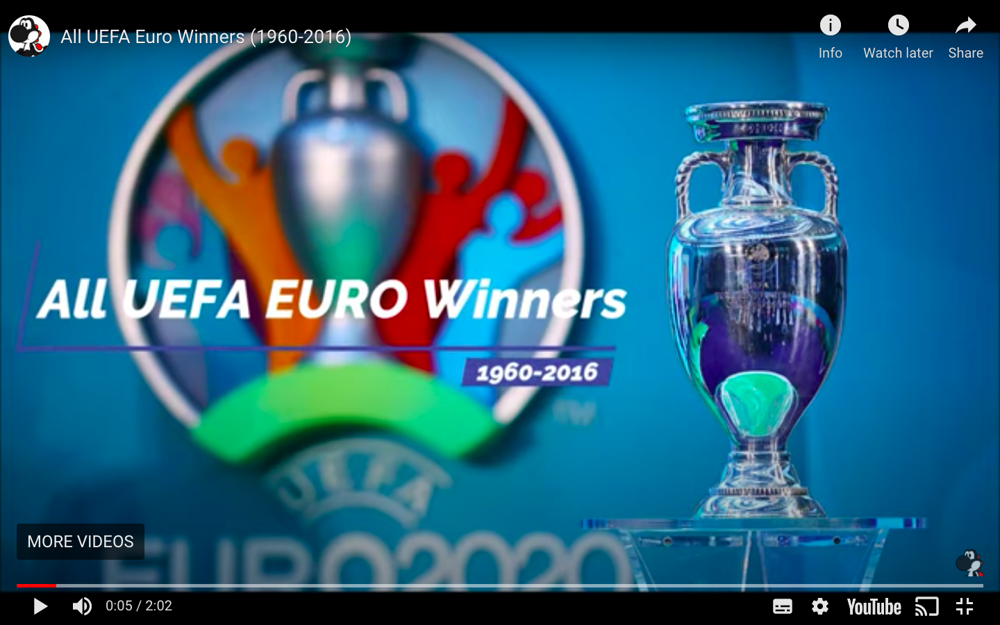

[Back to top ⇧](#the-euro-football-quiz)

### User stories tested

* ### Story 1
    I am an England Football fan. I have always followed England since I starting watching football as a young boy in the early 1980’s. I would like to know more about the tournament going back before I was born to get a better understanding of who hosted and who won the tournament. 
    
    - **The homepage has a timeline with lots of information to start with. Each moment in history on the timeline is also a link to a wikipedia page for even more information. Each link opens in a new tab making it easy for the user to go back to The Euro football quiz site. The tournament.html page also would give the user more information about the history of the competition.**

* #### Steps to take
    On the homepage the timeline can be found to the right of the main hero image on desktops and below the image on mobile screens.  

    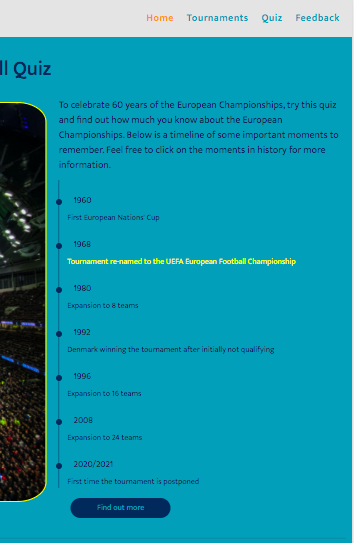

    Landing page for the yellow selected link as shown above

    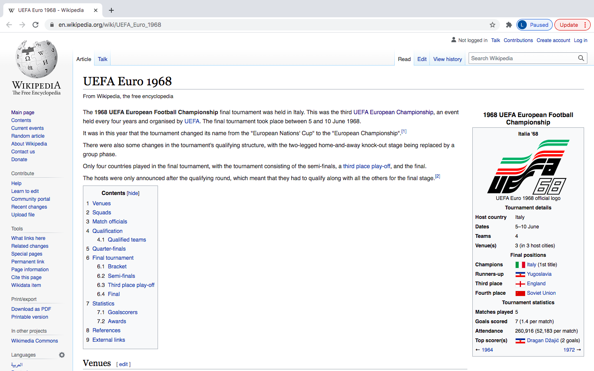

    For more information about the Euros, the user can also navigate to the tournaments page by clicking on the title page at the top right. 

    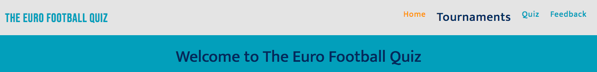

    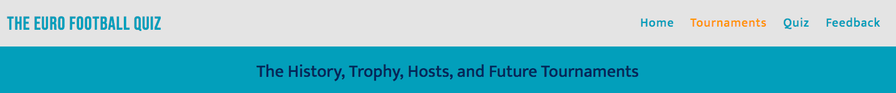

    Alternatively, the user can click the 'Find out more' button found below the timeline on the homepage which also would take them to the tournaments.html page.

    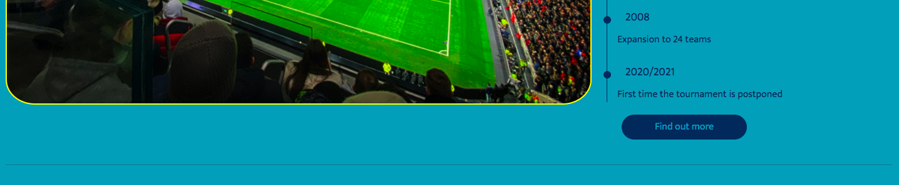

    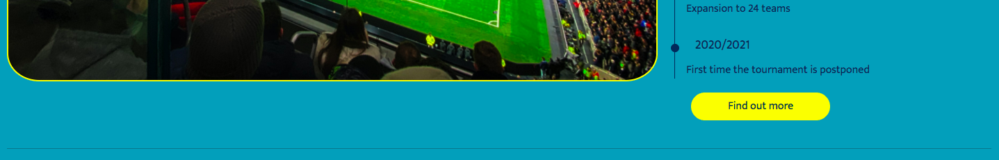

    Landling page - tournaments.html 

    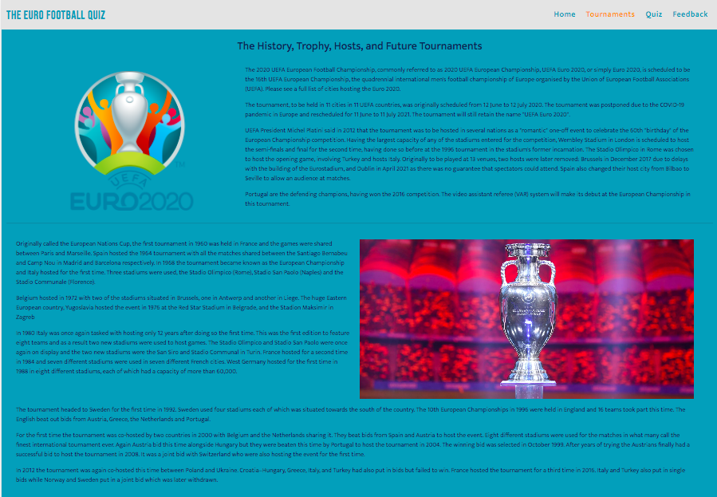

[Back to top ⇧](#the-euro-football-quiz)

* ### Story 2
    I’m a sports enthusiast and always enjoy being challenged when it comes to football knowledge.  

    - **This user can go straight to the quiz.html page and test their knowledge of the competition. The best way to do this is by clicking on the navigation bar link at the top of the homepage.**  

* #### Steps to take
    From the homepage click on the quiz link within the navigation menu found at the top right of the page. 

     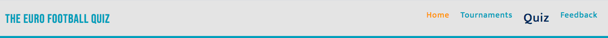

    If the user is on the tournaments.html page they can also click the 'Take the quiz' button found at the bottom of the page 

    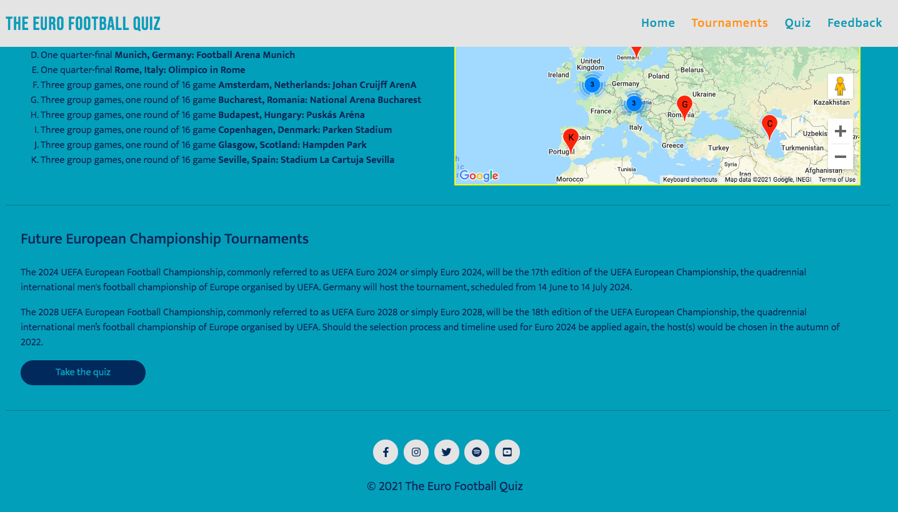

    Landling page - quiz.html 

    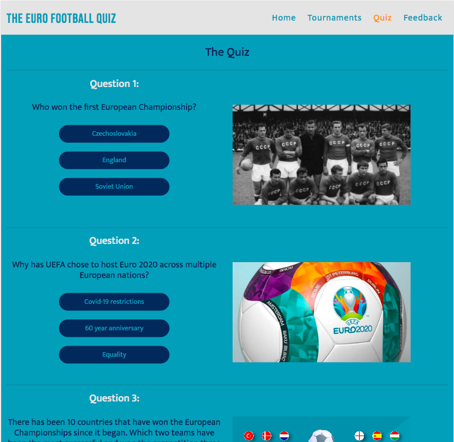

[Back to top ⇧](#the-euro-football-quiz)

* #### Story 3 
    I’m part of a weekly pub quiz team. I would like to know more about international football and gain more general knowledge to improve my contribution when I'm with my pub quiz team. 

    - **This user would find the tournaments.html page useful to get some top level information about the competition that would most likely help when it comes to questions being asked in a pub quiz environment. The quiz.html page may be useful to test their knowledge before and after reading the tournaments information.**

* #### Steps to take
    Click on the tournament title page at the top right within the navigation menu.  

    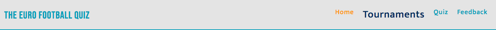

    Alternatively, click the 'Find out more' button found below the timeline on the homepage.

    

    

    Landling page - tournaments.html 

    

    The user can also test their knowledge before or afterwards by click on the quiz.html by either clicking the the quiz page on the top right navigation menu or clicking the 'Take the quiz' button at at the bottom of the tournaments page. 

    

    

    Landling page - quiz.html 

    

[Back to top ⇧](#the-euro-football-quiz)

* #### Story 4 
    I like taking my children to sports events and would like to know whether this football tournament is due to be hosted at some point soon that's close enough to travel to and attend a couple of games.  

    - **This user can navigate to the tournements.html page where the title is 'The History, Trophy, Hosts, and Future Tournaments'.  They can then find information about the current tournament being played as of 11th June to 11th July 2021 and future tournaments to be played. The user can plan trips to a future Euros game convenient to them.**
* #### Steps to take
    Click on the tournament title page at the top right of the navigation menu. 

    

    

    Alternatively, click the 'Find out more' button found below the timeline on the homepage

    

    

    Landling page - tournaments.html.

    Scroll down to the bottom of this page to see information about the current and future competitions. This will give the user geographical information of where the hosting nations are with contents and a google map to refer to.

    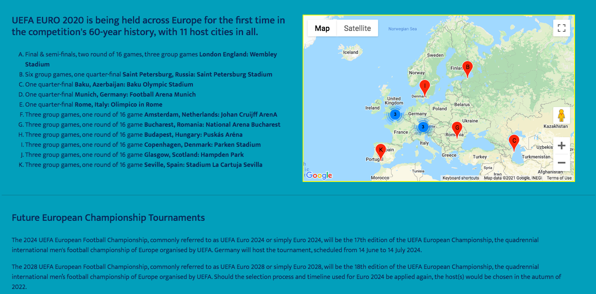

[Back to top ⇧](#the-euro-football-quiz)

* #### Story 5
    I would like to been notified of future tournaments relating to International European football.

    - **This user can navigate to the feedback.html page and complete the quick and easy form with name, email and feedback message requesting more information.**  

* #### Steps to take
    From the homepage the user can click the feedback.html page from the top right of the navigation menu. 

    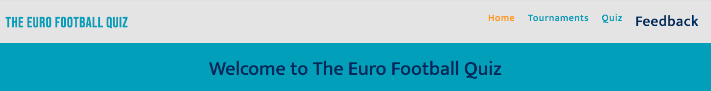

    If the user goes to the quiz.html page and completes the quiz a 'Leave feedback' button appears. This button will also take the user to the feedback form to complete. 

    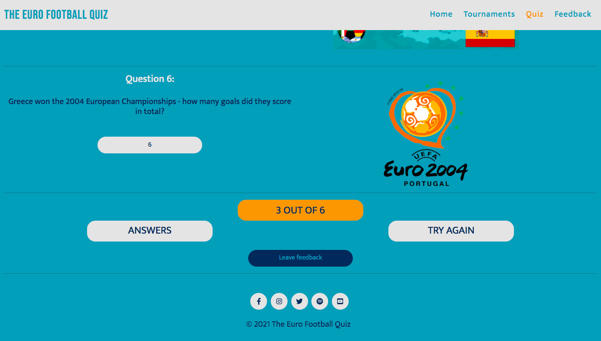

    Landling page - feedback.html

    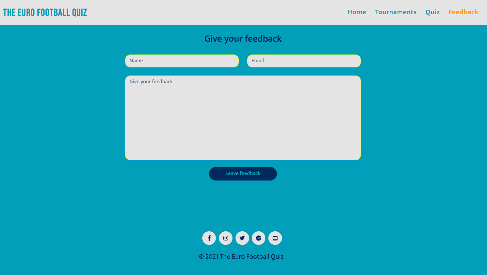

[Back to top ⇧](#the-euro-football-quiz)

### W3C Markup Validation Service

The W3C Markup Validator was used to validate all coding on all five HTML pages of my project.

#### Homepage tested 
(1 error found)

1. The element 'a' must not appear as a descendant of the button element. 

    - **How I resolved this error:** I decided to change the button element to a div element making sure that the link was maintained. A little work using CSS was required to position the button where i wanted it to be. 

I re-tested the code on W3C Markup validator and no errors were found.

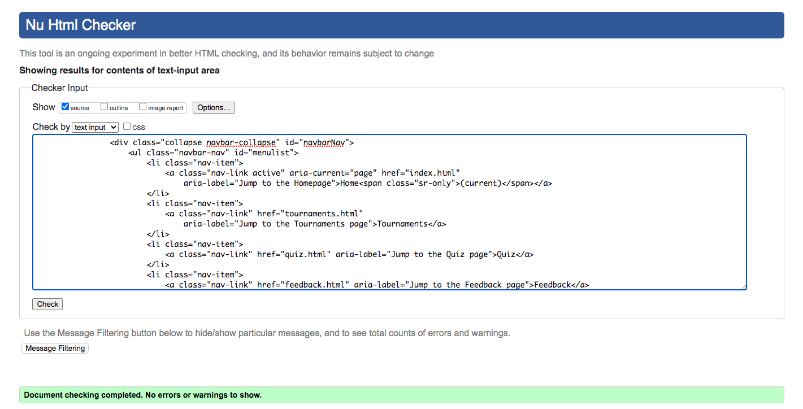

[Back to top ⇧](#the-euro-football-quiz)

#### Tournament page tested 
(2 errors found)

1. The element 'a' must not appear as a descendant of the button element. 

    - **How I resolved this error:** I decided to change the button element to a div element making sure that the link was maintained. A little work using CSS was required to position the button where i wanted it to be. 

1. The frameborder attribute on the iframe element is obsolete. Use CSS instead.

    - **How I resolved this error:** I removed the frameborder="0" code and made sure that the right CSS code was added in my styling sheet.

I re-tested the code on W3C Markup validator and no errors were found.

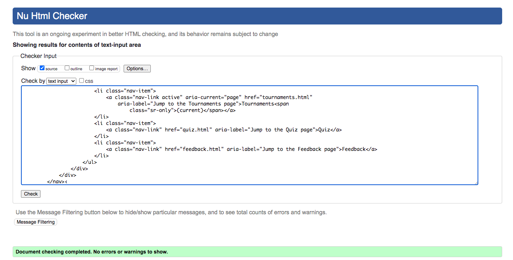

[Back to top ⇧](#the-euro-football-quiz)

#### Quiz page tested 
(3 error found)

1. 3 x The element 'a' must not appear as a descendant of the button element. 

    - **How I resolved this error:** I decided to change the button element to a div element making sure that the link was maintained. A little work using CSS was required to position the buttons where i wanted it to be. This was very important as this page is interactive and certain buttons which are now divs would disappear when the "SEE YOUR SCORE' button is clicked. 

I re-tested the code on W3C Markup validator and no errors were found.

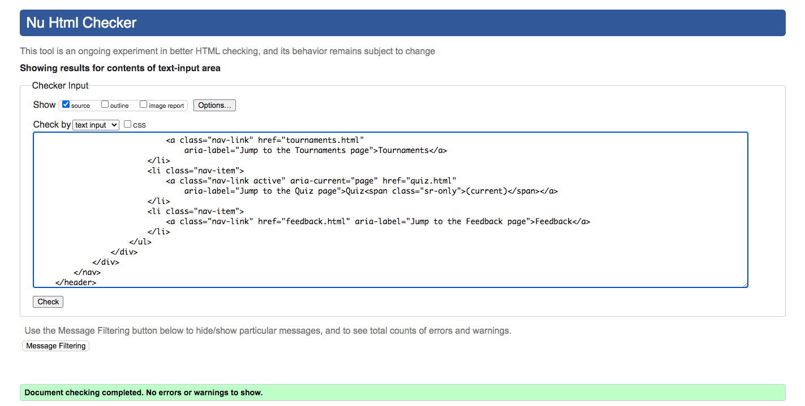

[Back to top ⇧](#the-euro-football-quiz)

#### Feedback page tested 
(0 errors found)
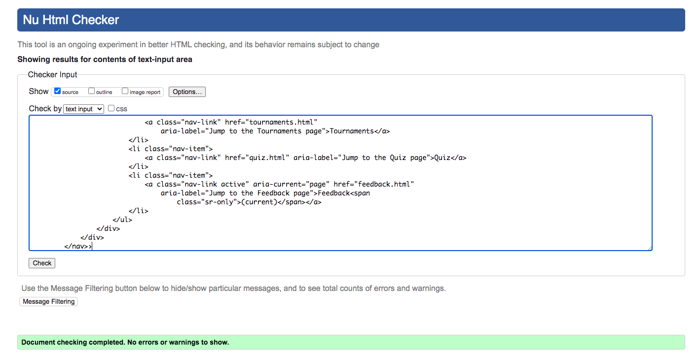

#### Answers page tested 
(2 error found)

1. 2 x The element 'a' must not appear as a descendant of the button element. 

    - **How I resolved this error:** I decided to change the button element to a div element making sure that the link was maintained. A little work using CSS was required to position the buttons where i wanted it to be.  

I re-tested the code on W3C Markup validator and no errors were found.

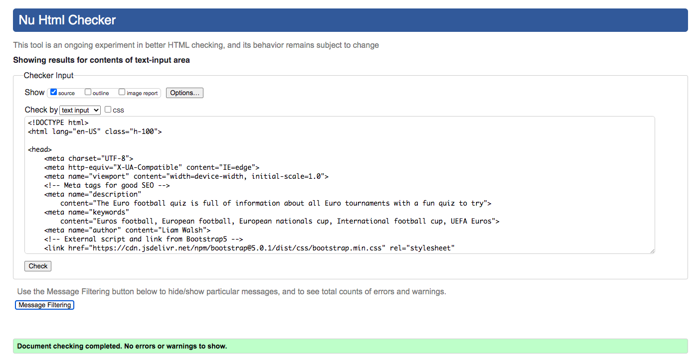

 **HTML Testing completed**

[Back to top ⇧](#the-euro-football-quiz)

### W3C CSS Validation Service

The W3C CSS Validator was used to validate all CSS used for my project.

#### CSS coding tested
* 0 errors returned
* 2 warnings returned
    - Imported style sheets are not checked in direct input and file upload modes (line 2)
    - Same color for background-color and color (line 345 reference: #submit-feedback-btn)

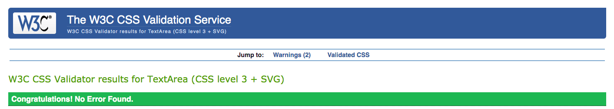

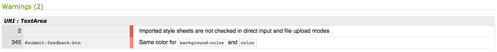

I removed the code that was causing the issue with the same color for the background as the font color. This resolved the 2nd warning and then re-tested the css code. 

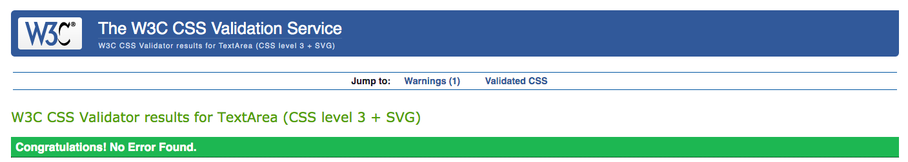

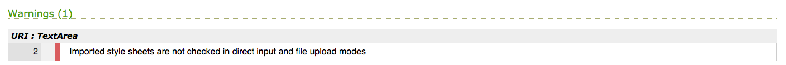

In reference to the remaining error - Imported style sheets are not checked in direct input and file upload modes (line 2). I found some information on <a href="https://stackoverflow.com/questions/25946111/importing-css-is-ending-up-with-an-error" target="_blank">Stack overflow</a> confirming that this was not an error just a warning to remind me that not checking the Google fonts is okay as this validator is used to check the CSS code. 

**CSS Testing completed**

[Back to top ⇧](#the-euro-football-quiz)

### JS Hint Javascript code validator

JSHint, A Static Code Analysis Tool for JavaScript. This is a tool that detects errors and potential problems in JavaScript code.

#### maps.js
* (0 errors found)

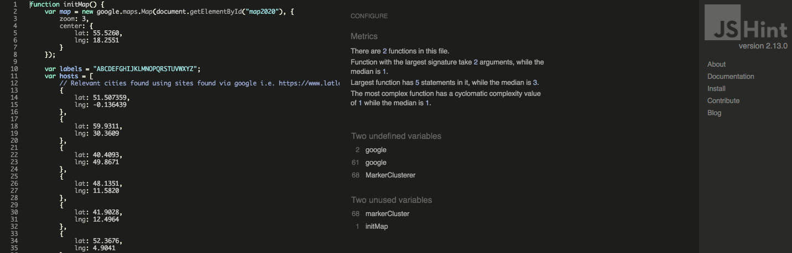

#### quiz.js
* (0 errors found)

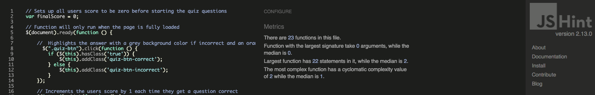

#### sendEmail.js
* (0 errors found)

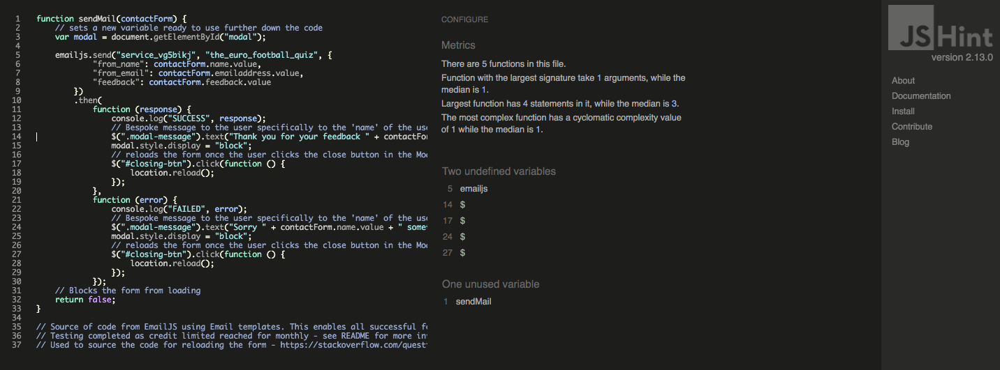

**Javascript Testing completed**

[Back to top ⇧](#the-euro-football-quiz)

### Web Browsers

I tested the website across four different web browsers making sure that links worked and pages loaded properly. 

- #### Google Chrome 
The site was developed using Chrome and therefore testing was being done daily on this browser.

Homepage

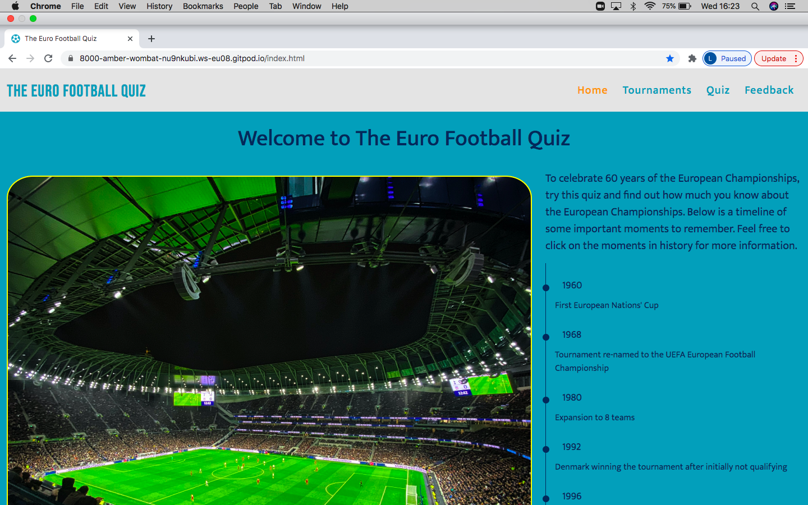

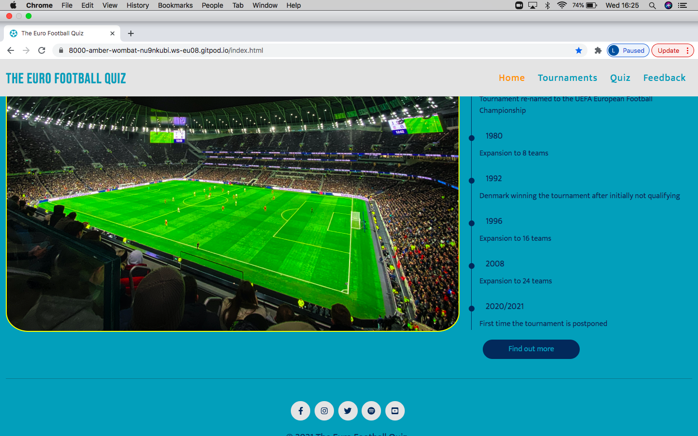

Tournaments page

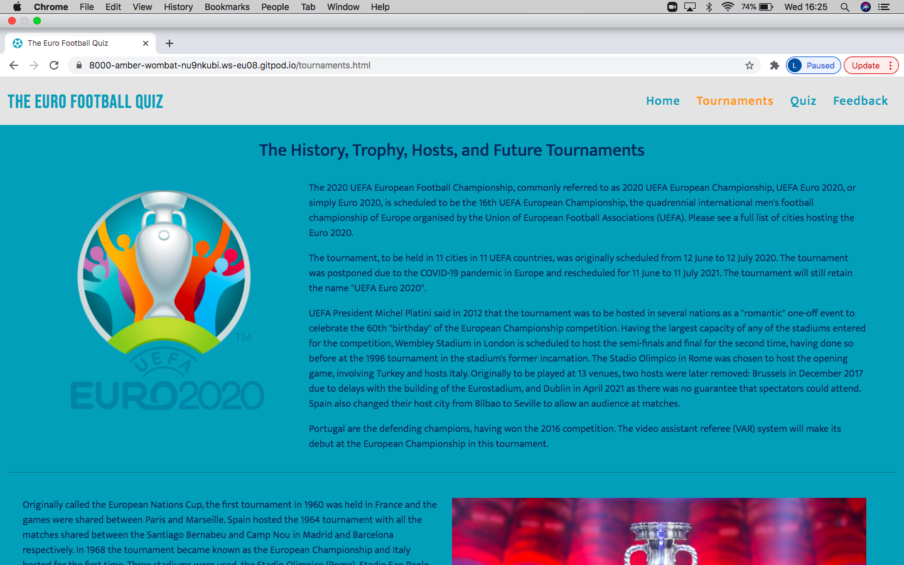

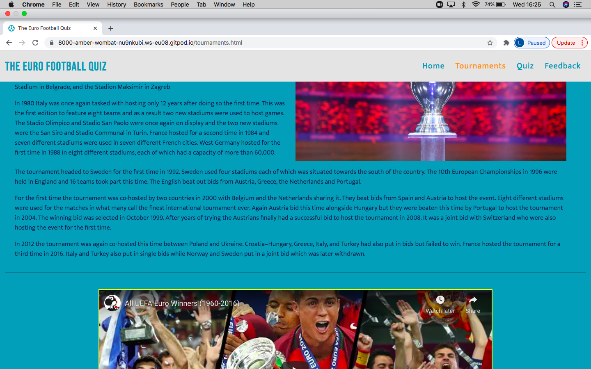

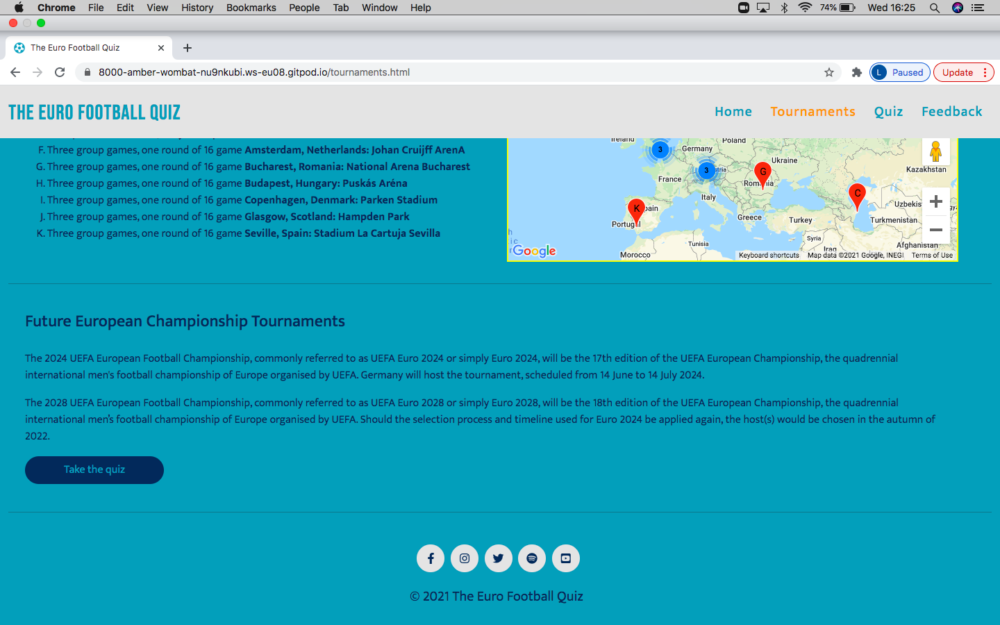

Quiz page

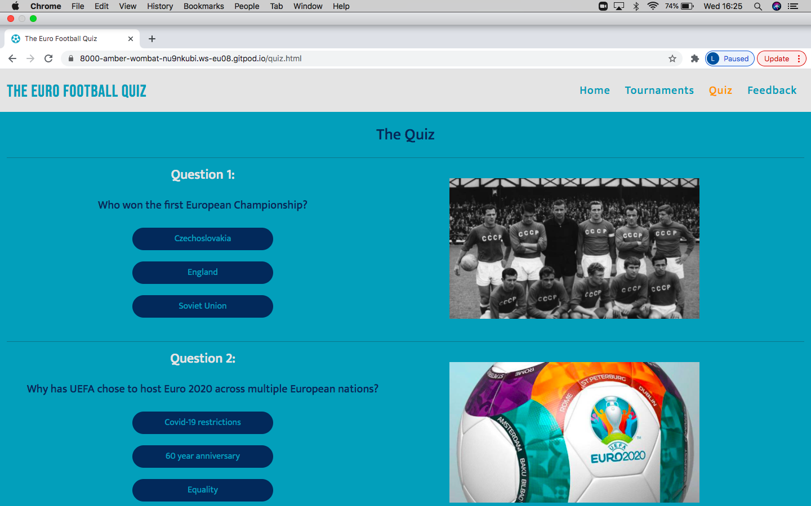

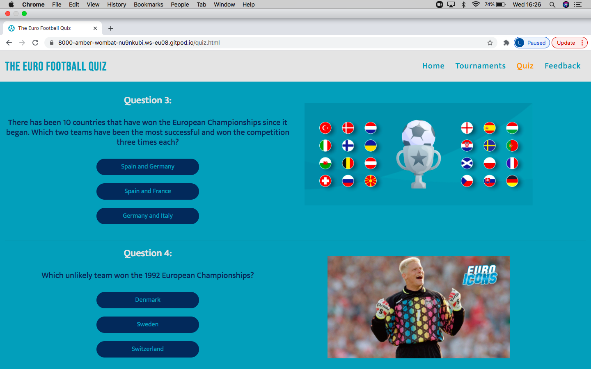

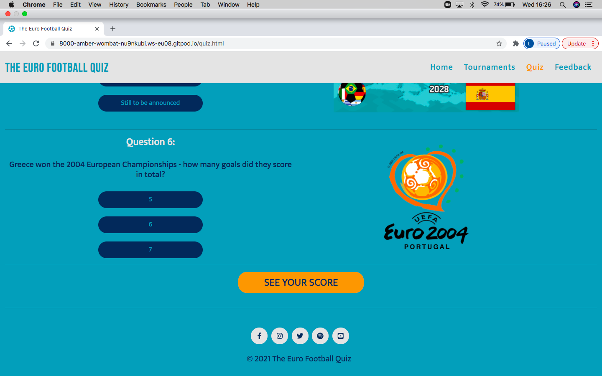

Feedback page


Answers page


[Back to top ⇧](#the-euro-football-quiz)

- #### Apple Safari

Using a Macbook to complete this project meant that i could test the webpages on Apple safari. 

IMAGES TO FOLLOW ONCE SITE IS DEPLOYED AND RETESTED

[Back to top ⇧](#the-euro-football-quiz)

- #### Microsoft Edge

I had Microsoft Edge downloaded already. I therefore, logged onto my gitpod workspace and tested the site in the Microsoft Edge browser. I checked to make sure that all pages loaded, the colors, images, content, links and button all looked and worked fine. I tested this across different screen sizes within Microsoft Edge.

Homepage


Tournaments page


Quiz page


Feedback page


Answers page


[Back to top ⇧](#the-euro-football-quiz)

#### Mozilla Firefox 

I had Firefox downloaded already. I therefore, logged onto my gitpod workspace and tested the site in the Firefox browser. I checked to make sure that all pages loaded, the colors, images, content, links and button all looked and worked fine. I tested this across different screen sizes within Firefox.

Homepage


Tournaments page


Quiz page


Feedback page


Answers page


[Back to top ⇧](#the-euro-football-quiz)

### Testing responsiveness

I tested the site using Chrome development tools on four different screen sizes to make sure that all features, content, images, media clip, google map, links, buttons and feedback form worked properly. 

- #### Mobile screenshots

Homepage


Tournaments page


Quiz page


Feedback page


Answers page


[Back to top ⇧](#the-euro-football-quiz)

- #### Tablet screenshots

Homepage


Tournaments page


Quiz page


Feedback page


Answers page


[Back to top ⇧](#the-euro-football-quiz)

- #### Desktop screenshots

Homepage


Tournaments Page


Quiz page


Feedback page


Answers page


[Back to top ⇧](#the-euro-football-quiz)

- #### Large Desktop screenshots

Homepage


Tournaments page


Quiz page


Feedback page


Answers page


[Back to top ⇧](#the-euro-football-quiz)

### Lighthouse testing 

#### Desktop results

* Performance 94%
* Accessibility 97%
* Best Practices 93%
* SEO 100%


#### Mobile results

* Performance 74% (Issues: Largest Contentful Paint)
* Accessibility 97%
* Best Practices 93%
* SEO 100%


In reference to the performance score on the mobile lighthouse results (74%), i would look to try and fix this using <a href="https://web.dev/lcp/#how-to-improve-largest-contentful-paint-on-your-site" target="_blank">Information</a> found online. 

[Back to top ⇧](#the-euro-football-quiz)

## Issues found

### API key
* API key for the google map on the tournaments page wasn't working at first. All the code looked right however the map still wasn't importing onto the html page. I found this <a href="https://developers.google.com/maps/documentation/javascript/error-messages#api-not-activated-map-error" target="_blank">document</a> that helped me in fixing the issue which was to do with the API restrictions that wasn't set. 

### Quiz images
* The Quiz question clue images didn't look great when using the background size property with the cover value as it caused an issue with the images on different screen sizes. I changed the value for all images from cover to contain which worked for what i wanted to acheieve which was to make sure that all of images can be shown on clearly on all screen sizes. 

Before


After


[Back to top ⇧](#the-euro-football-quiz)

### Feedback form
* Feedback html page - name, email and feedback sections wasn't refreshing after clicking the submit button. I added a modal and with some Javascript this fixed the issue. Unfortunately, this led to another issue with the modal - documented below. 


[Modal Javascript](assets/js/sendEmail.js)


[Back to top ⇧](#the-euro-football-quiz)

### Modal issues
* I added a modal for a message to appear when a user completes the form and clicks submit. This didn't work properly at first. The issue was that with or without the form being filled in, when clicking the submit button the modal message would appear empty everytime. Additionally if the form was completed without details filled in the modal message would still appear along with the warning message 'Please fill in this field'. The warning message was applied using the 'required' attribute in the HTML code. What i wanted to achieve was for the user to only see a modal message when the form was filled in correctly without any warning messages. I also wanted only the warning message to appear and not the modal message if a user didn't complete all fields correctly. 

Image of the modal issue


Javascript before fixing the issues

* After researching what Javascript i needed to use for the modal and feedback form to work I spoke briefly with a Code Institute tutor and my mentor. I worked out the i needed to create a variable to get the modal ID and then apply the style.display method to it. I added the location.reload method to the close button in the modal and then added a second modal message for any forms that were completed properly but for whatever didn't successfully deliver. This all worked well and with some testing and making sure the HTML code was correct i acheieved what i wanted. 

Javascript after fixing the issues

Full Javascript code
[Modal Javascript](assets/js/sendEmail.js)

Full HTML code
[HTML Feedback form code](feedback.html)

Feedback form submitted with feedback text missing


Feedback form submitted with email text missing


Feedback form submitted with name text missing


[Back to top ⇧](#the-euro-football-quiz)

### EmailJS
* With the EmailJS account the maximium amount of free emails you can receive each month is 200. I reached this limited during testing. This means that until the account is either upgraded or refreshed next month every feedback form completed will receive a modal message saying - Sorry {name} something went wrong. Please try submitting your feedback again!

Feedback form sent with all fields completed

Email from EmailJS referencing the issue


Example of what the user should see when submitting the feedback form correctly


What would be received based on the above example via EmailJS


[Back to top ⇧](#the-euro-football-quiz)

## Further testing

### Mobile first
* I know its important to build a new site as a mobile first application, therefore, during the design process and building the site i made sure that extensive testing was done on all mobile screen sizes using <a href="https://developer.chrome.com/docs/devtools/" target="_blank">Chrome development tools</a>. I worked with the following screen sizes making sure that all users can enjoy the site using any type of smartphone device: - 

    - 280px (Galaxy Fold size) 
    - 320px (iPhone 5 size)
    - 360px (Moto G4 and Galaxy S5) 
    - 375px (iPhone 6/7/8/X size)
    - 411px (Pixel 2/XL and iPhone 6/7/8 plus) 

### External links

* I tested all five social media links found in the footer. Testing was completed across all five pages on all screen sizes across multiple web browsers. All links worked and opened in a new browser tab which is what i wanted to achieve. 

* I tested all seven timeline moments in history. Each is connected to a relevant wikipedia page giving users more information. When click these links are clicked a new browser tab opens which again is what i wanted to achieve. All testing for these links were tested across different screen sizes and different web browsers. 
 
### Internal links

* I tested all navigation menu links found in the header. All links worked successfully throughout the website and across all screen sizes and web browsers. I did further testing to make sure that the navigation bar on smaller screens worked as the menu turns into a hamburger bar (three horizontal lines) and therefore a dropdown menu opens and closes when the hamburger menu is clicked.

* I tested all internal buttons found on all web pages. Testing was completed across all screen sizes and web browsers. All buttons work based on their purpose i.e. moving to another part of the website or revealing the score on the quiz page once answers are selected.

[Back to top ⇧](#the-euro-football-quiz)

## Bugs outstanding

* Lighthouse testing on mobile devices: -
With the performance results coming out a little lower than i wanted at 74%, i decided to start investigating this. The results confirmed that the issue is with Largest Contentful Paint. I found some useful <a href="https://web.dev/lcp/#how-to-improve-largest-contentful-paint-on-your-site" target="_blank">Information</a>. A couple of other sites i found to look into this further were <a href="https://imageengine.io/" target="_blank">Image Engine</a> and <a href="https://nitropack.io/blog/post/reduce-largest-contentful-paint-lcp" target="_blank">Nitro Pack</a>. Another site i found which could help resolve this issue is the <a href="https://web.dev/optimize-lcp/#render-blocking-resources" target="_blank">Optimize LCP</a>. This issue is something i will need to look into ready for my next project. 

* Safari - missing images

[Back to top ⇧](#the-euro-football-quiz)

Return to my [README.md](README.md) to continue reading

### End of TESTING Document

